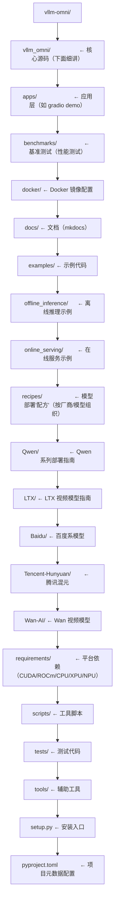
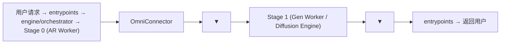

# 02 · 项目结构：目录树一览

**源码**：[`code/vllm-omni/vllm_omni/`](../../code/vllm-omni/vllm_omni/)

## 整体目录结构

## `vllm_omni/` 核心源码目录详解

| 目录 | 作用 | 一句话概括 |
|------|------|-----------|
| **entrypoints/** | 对外接口层 | 用户从这里进入系统 |
| ├ `omni.py` / `async_omni.py` | 同步/异步入口 | `Omni.generate()` 和 `AsyncOmni` 服务器 |
| ├ `openai/` | OpenAI 兼容 API | Chat/Image/Audio/Video API 实现 |
| └ `cli/` | 命令行工具 | `vllm-omni serve` 命令 |
| **engine/** | 引擎层 | 编排多个 Stage 的核心 |
| ├ `orchestrator.py` | 编排器 | 跨 Stage 的请求路由和生命周期管理 |
| ├ `stage_pool.py` | Stage 池 | 管理每个 Stage 的多个副本 |
| └ `stage_engine_startup.py` | Stage 启动 | 初始化每个 Stage 的推理进程 |
| **config/** | 配置层 | 模型配置、Stage 配置、Pipeline 配置 |
| ├ `model.py` | `OmniModelConfig` | 多 Stage 模型的核心配置类 |
| ├ `stage_config.py` | Stage 配置 | 单个 Stage 的配置 |
| └ `pipeline_registry.py` | Pipeline 注册 | 注册"模型→多个 Stage"的映射 |
| **core/** | 核心调度 | AR 模式的调度器 |
| └ `sched/` | 调度器 | `omni_ar_scheduler`、`omni_generation_scheduler` |
| **worker/** | GPU Worker | 在每个 Stage 进程中执行推理 |
| ├ `gpu_ar_worker.py` | AR Worker | 自回归模型的 Worker |
| ├ `gpu_ar_model_runner.py` | AR Model Runner | AR 模型的 forward |
| ├ `gpu_generation_worker.py` | Generation Worker | 非自回归模型的 Worker |
| └ `gpu_generation_model_runner.py` | Generation Model Runner | 非自回归模型的 forward |
| **diffusion/** | 扩散引擎 | 扩散模型的专属执行环境 |
| ├ `diffusion_engine.py` | 扩散引擎 | 扩散模型的总控制器 |
| ├ `models/` | 扩散模型实现 | Flux/Wan/LTX/Qwen-Image 等 |
| ├ `sched/` | 扩散调度器 | 请求调度 + 去噪步调度 |
| ├ `worker/` | 扩散 Worker | 扩散模型的 GPU 执行 |
| └ `distributed/` | 扩散分布式 | 序列并行、VAE 并行 |
| **model_executor/** | 模型实现 | 模型的注册和具体实现 |
| ├ `models/` | AR 模型 | Qwen2.5-Omni/Qwen3-Omni/CosyVoice 等 |
| ├ `stage_configs/` | Stage 配置 YAML | 定义每个模型的 Stage 拆分 |
| └ `stage_input_processors/` | 输入处理器 | Stage 间的数据转换逻辑 |
| **distributed/** | 分布式通信 | 跨 Stage 和跨节点通信 |
| ├ `omni_connectors/` | OmniConnector | KV Cache 跨 Stage 传输 |
| └ `omni_coordinator/` | 协调器 | 多节点部署协调 |
| **platforms/** | 多平台支持 | CUDA/ROCm/NPU/XPU/MUSA |
| **quantization/** | 量化 | INT8/INC/GGUF 等量化方案 |
| **transformers_utils/** | Transformers 工具 | HF Transformers 的配置和处理器扩展 |
| **profiler/** | 性能分析 | Torch Profiler 集成 |
| **metrics/** | 指标收集 | 性能指标统计 |
| **utils/** | 通用工具 | 音频处理、Speaker Cache 等 |
| **lora/** | LoRA 支持 | AR 模型的 LoRA |
| **inputs/** | 输入类型 | Prompt 类型定义 |

## 关键数据流

## 阅读时间

约 15 分钟。可以把这个目录当"地图"用，不定时回来查。
