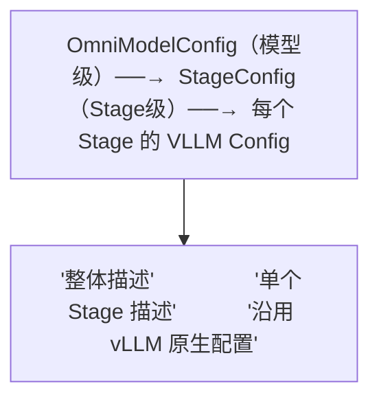

# 03 · 配置系统：OmniModelConfig 与 PipelineRegistry

**源码**：
- [`code/vllm-omni/vllm_omni/config/model.py`](../../code/vllm-omni/vllm_omni/config/model.py)
- [`code/vllm-omni/vllm_omni/config/pipeline_registry.py`](../../code/vllm-omni/vllm_omni/config/pipeline_registry.py)
- [`code/vllm-omni/vllm_omni/config/stage_config.py`](../../code/vllm-omni/vllm_omni/config/stage_config.py)

## 配置系统的层次

vLLM-Omni 的配置分为三层：



## OmniModelConfig —— 模型级配置

[`OmniModelConfig`](../../code/vllm-omni/vllm_omni/config/model.py) 继承自 vLLM 的 `ModelConfig`，新增了 Omni 特有的字段：

| 字段 | 默认值 | 含义 |
|------|--------|------|
| `stage_id` | `0` | 当前 Stage 的编号（0=第一个 Stage） |
| `model_stage` | `"thinker"` | Stage 类型标识（thinker/talker/code2wav 等） |
| `model_arch` | `None` | 模型架构名（用于在注册表中查找） |
| `worker_type` | `None` | Worker 类型（"ar" 或 "generation"） |
| `engine_output_type` | `None` | 引擎输出类型（"image"/"audio"/"latents"） |
| `hf_config_name` | `None` | HF 配置中的子配置名（如 "thinker_config"） |
| `async_chunk` | `False` | 是否启用异步分块（流式跨 Stage） |
| `stage_connector_config` | `{"name":"SharedMemoryConnector"}` | Stage 间连接器配置 |
| `task_type` | `None` | TTS 模型的任务类型（CustomVoice/VoiceDesign/Base） |
| `enable_sleep_mode` | `False` | 是否允许 Stage 休眠省显存 |

### 核心方法：`from_vllm_model_config`

这是最常用的创建方式。从一个已有的 vLLM `ModelConfig` + Omni 特定参数创建一个 `OmniModelConfig`：

```python
omni_cfg = OmniModelConfig.from_vllm_model_config(
    vllm_model_config,
    stage_id=0,
    model_stage="thinker",
    model_arch="Qwen2_5OmniForConditionalGeneration",
)
```

它通过 `object.__new__` 直接分配实例（避免重新运行 ModelConfig 的昂贵验证），然后复制原本的配置属性，再加上 Omni 特有字段。

### `hf_config_name` 的作用

大多数全模态模型的 HuggingFace `config.json` 包含子配置：

```json
{
  "thinker_config": { "text_config": { ... }, "audio_config": { ... } },
  "talker_config": { "text_config": { ... }, ... }
}
```

`hf_config_name` 告诉代码去读哪个子配置。`draw_hf_text_config()` 方法实现了这个逻辑——从对应子配置中提取 `text_config` 作为当前 Stage 的文本配置。

## PipelineRegistry —— 模型到 Stage 的映射

[`PipelineRegistry`](../../code/vllm-omni/vllm_omni/config/pipeline_registry.py) 定义了"哪个模型有几个 Stage、每个 Stage 是什么类型"。它通过 YAML 配置文件来声明，实际配置文件位于 `model_executor/stage_configs/` 目录下。

每个模型的 Pipeline 配置包含：

```yaml
# 示例：Qwen-Omni 的三 Stage 配置
model_arch: Qwen2_5OmniForConditionalGeneration
stages:
  - stage_id: 0
    model_stage: thinker
    worker_type: ar
  - stage_id: 1
    model_stage: talker
    worker_type: generation
  - stage_id: 2
    model_stage: token2wav
    worker_type: generation
```

当 `Orchestrator` 启动时，它会根据 `PipelineRegistry` 知道需要创建几个 StagePool、每个 Stage 用什么 Worker。

## Stage 连接器配置

`stage_connector_config` 控制 Stage 间的通信方式：

```python
# 默认使用共享内存连接器
{"name": "SharedMemoryConnector", "extra": {}}

# 使用 Mooncake Transfer Engine（用于跨节点）
{"name": "MooncakeTransferEngineConnector", "extra": {"metadata_server": "..."}}
```

连接器的选择影响性能：共享内存最快（同机），Mooncake/Yuanrong 用于跨节点。

## 量化配置的 Stage 感知

`OmniModelArchConfigConvertor` 是一个特殊的配置转换器，确保每个 Stage 只应用"属于自己的"量化配置。因为多 Stage 模型可能只有 Thinker 被量化了（FP8），而 Talker/Code2Wav 保持原精度。如果所有 Stage 都用同一个量化配置，就会出错。

## 阅读时间

约 20 分钟。重点理解 `OmniModelConfig` 的字段含义和 `from_vllm_model_config` 的创建逻辑。
