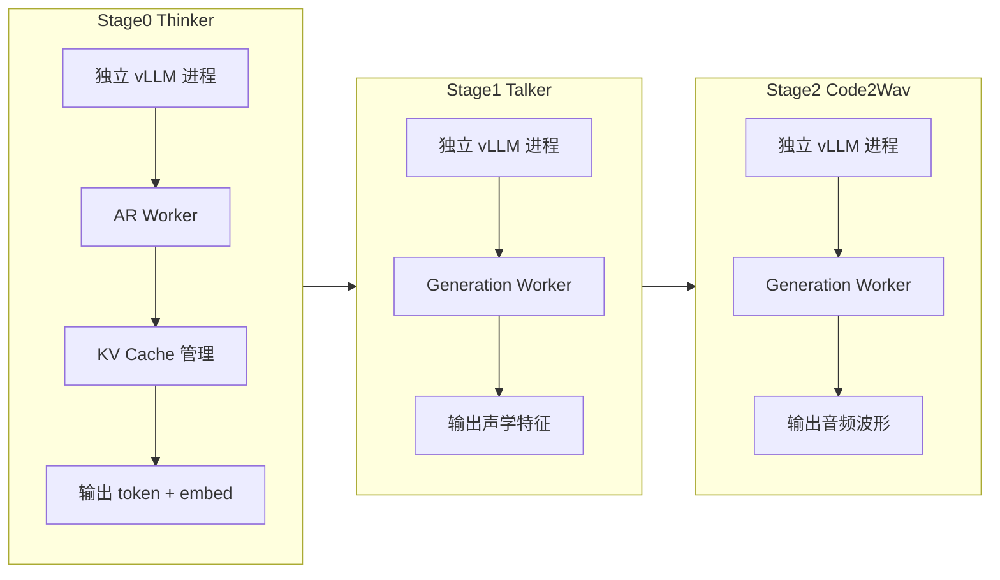
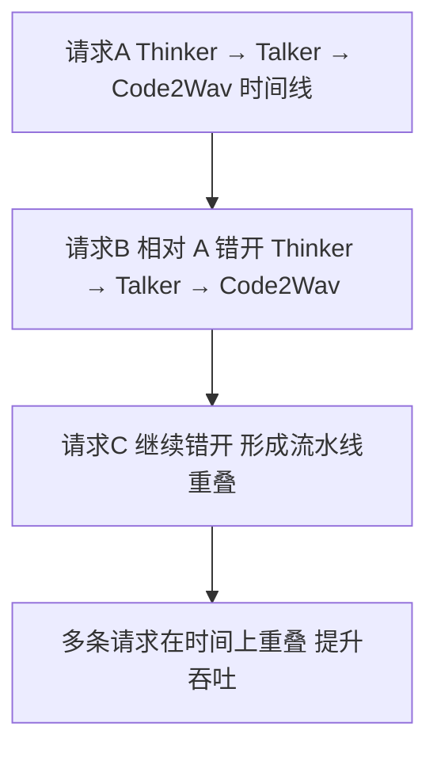

# 01 · 流水线架构概念：为什么需要多 Stage

**源码**：
- [`code/vllm-omni/vllm_omni/engine/orchestrator.py`](../../code/vllm-omni/vllm_omni/engine/orchestrator.py)
- [`code/vllm-omni/vllm_omni/model_executor/stage_configs/`](../../code/vllm-omni/vllm_omni/model_executor/stage_configs/)

## 问题：一个模型为什么不能在一个 Stage 里跑

全模态模型看起来是"一个模型"，但实际上它由多个子网络组成。用 Qwen-Omni 举例：

- **Thinker**：一个 7B 的 MoE Transformer（处理文字理解 + 图片理解 + 音频理解）
- **Talker**：一个独立的 Transformer 解码器（只处理"说话"这件事）
- **Code2Wav**：一个神经声码器（只做"编码转波形"）

这三个子网络**模型结构不同、推理模式不同、依赖关系也不同**。如果强行放在一起，问题很多：

1. **显存浪费**：Thinker 推理时 Talker 占着显存不用，反之亦然
2. **计算模式冲突**：Thinker 是自回归（逐 token），Code2Wav 是一次性生成，调度策略完全不同
3. **无法独立扩展**：Thinker 需要大显存，Talker 对算力要求高，分开才能分别扩容
4. **无法流水线并行**：当 Thinker 在处理请求 A 的第 2 个 token 时，Talker 可以同时处理请求 A 的第 1 个 token 的输出，吞吐量就上去了

## vLLM-Omni 的解法：多 Stage 流水线

把模型拆成多个 Stage，每个 Stage 是一个**独立进程**，有自己独立的 GPU 显存和推理调度器。Stage 之间通过"连接器"传输数据。

### 流水线的优势

## Stage 间的数据传递

Stage 间的数据不是简单的文本，而是多种形式：

| 传递方向 | 传递内容 | 格式 |
|----------|---------|------|
| Thinker → Talker | 文本 token + 音频控制 code | `OmniTokensPrompt`（dict） |
| Thinker → Diffusion | 文本 embedding | `prompt_embeds`（tensor） |
| Talker → Code2Wav | 声学特征 code | `prompt_token_ids` + audio codes |
| 同 Stage (PD) | KV Cache | 通过 OmniConnector 传输 |
| 同 Stage (CFG) | 条件/无条件结果 | 两个请求完成后合并 |

每个 Stage 的 `stage_input_processor` 负责将上一 Stage 的输出转为下一 Stage 的输入格式。

## Stage 类型对照

| Stage 类型 | worker_type | 推理模式 | 用什么引擎 | 典型模型 |
|-----------|-------------|---------|-----------|---------|
| thinker | ar | 自回归逐 token | AR Worker + AR Scheduler | Qwen Thinker, GLM AR |
| talker | generation | 一次生成所有 | Generation Worker | Qwen Talker, CosyVoice |
| code2wav | generation | 一次生成所有 | Generation Worker | Qwen Code2Wav |
| diffusion | (N/A) | 迭代去噪 | Diffusion Engine | Flux, Wan, LTX |

## 代码中的 Stage 定义

每个模型的 Stage 拆分定义在 `model_executor/stage_configs/` 目录下的 YAML 文件中，以及每个模型的 `pipeline.py` 文件中。例如 [`qwen3_omni/pipeline.py`](../../code/vllm-omni/vllm_omni/model_executor/models/qwen3_omni/pipeline.py) 定义了 Qwen3-Omni 的三 Stage 流程。

`PipelineRegistry` 会将模型的架构名映射到对应的 pipeline 配置，Orchestrator 据此创建 Stage Pool。

## 阅读时间

约 25 分钟。理解多 Stage 的必要性和数据流转方向是读懂整个项目的关键。
