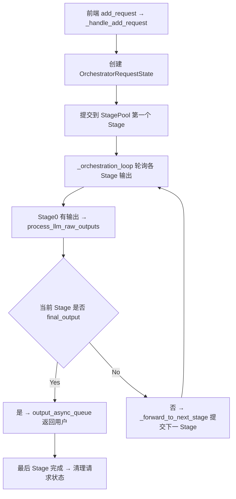

# 02 · Orchestrator 编排器：流水线的大脑

**源码**：[`code/vllm-omni/vllm_omni/engine/orchestrator.py`](../../code/vllm-omni/vllm_omni/engine/orchestrator.py)

## Orchestrator 是什么

`Orchestrator` 是 vLLM-Omni 最核心的类。它负责**跨 Stage 的请求路由和生命周期管理**——从用户提交请求到最终返回结果，全程由它协调。

它运行在一个**后台线程**中，拥有自己独立的 `asyncio` 事件循环。

## 核心成员

```python
class Orchestrator:
    request_async_queue   # 接收来自前端的消息
    output_async_queue    # 将结果发送回前端
    rpc_async_queue       # 处理控制面 RPC 请求
    stage_pools           # 每个 Stage 的副本池
    request_states        # 每个请求的状态跟踪
    _cfg_tracker          # CFG（classifier-free guidance）追踪器
```

## 主循环：`run()`

```python
async def run(self):
    request_task = asyncio.create_task(self._request_handler())
    output_task = asyncio.create_task(self._orchestration_output_handler())
    await asyncio.gather(request_task, output_task)
```

两个并发任务：

1. **`_request_handler()`**：从前端接收消息（新请求、流式更新、中止请求等）
2. **`_orchestration_output_handler()`**：轮询所有 Stage 的输出，并根据结果决定转发到下一 Stage 或返回前端

## 请求的生命周期



## 关键方法详解

### `_handle_add_request` —— 接收新请求

```python
async def _handle_add_request(self, msg):
    request_id = msg["request_id"]
    prompt = msg["prompt"]
    sampling_params_list = msg["sampling_params_list"]  # 每个 Stage 各一组参数
    final_stage_id = msg["final_stage_id"]               # 哪个 Stage 的结果返回用户

    req_state = OrchestratorRequestState(...)
    self.request_states[request_id] = req_state

    # 提交到第一个 Stage
    await self.stage_pools[0].submit_initial(request_id, req_state, prompt)
```

注意 `sampling_params_list` 是**一个列表**，[0] 给 Stage 0 用，[1] 给 Stage 1 用……

### `_forward_to_next_stage` —— Stage 间转发

这是编排器最复杂的方法。

```python
async def _forward_to_next_stage(self, req_id, src_stage_id, output, req_state):
    next_logical = src_stage_id + 1
    next_pool = self.stage_pools[next_logical]

    if next_pool.stage_type == "diffusion":
        # 扩散 Stage：调用 custom_process_input_func 转换输入
        diffusion_prompt = next_client.custom_process_input_func(source_outputs, ...)
        await next_pool.submit_initial(req_id, req_state, diffusion_prompt)
    else:
        # AR/Generation Stage：调用 process_engine_inputs 转换输入
        next_inputs = next_client.process_engine_inputs(source_outputs, ...)
        for next_input in next_inputs:
            request = build_engine_core_request_from_tokens(...)
            await next_pool.submit_initial(req_id, req_state, request)
```

### `_handle_kv_ready_raw_outputs` —— KV Cache 就绪转发

用于 PD（Prefill-Decode）解耦场景：

```python
async def _handle_kv_ready_raw_outputs(self, stage_id, raw_outputs):
    for raw_output in raw_outputs.outputs:
        kv_params = getattr(raw_output, "kv_transfer_params", None)
        if kv_params and kv_params.get("kv_ready"):
            # Stage 0 的 KV Cache 已经就绪，可以提交 Stage 1 了
            await self._forward_to_next_stage(req_id, stage_id, raw_output, req_state)
```

这意味着 Stage 1 可以在 Stage 0 **还没完全结束时**就开始工作——Prefill 一完成，Decode 就可以启动。

## 错误处理：`EngineDeadError`

当某个 Stage 的引擎意外死亡，Orchestrator 会：
1. 标记 `_fatal_error`
2. 通知所有已提交到该 Stage 的请求
3. 排空待处理队列中的请求
4. 关闭所有其他 Stage

目前的策略是"fail-stop"——一个 Stage 挂了，整个流水线停掉。这是因为保持部分健康的 Stage 继续运行又无法完成任何请求没有意义。

## 异步分块（Async Chunk）模式

当 `async_chunk=True` 时，Orchestrator 会在请求提交 Stage 0 后，立即**预提交** (prewarm) 下游 Stage：

```python
if self.async_chunk and stage_id == 0 and final_stage_id > 0:
    await self._prewarm_async_chunk_stages(request_id, prompt, req_state)
```

预提交用占位 token 初始化下游 Stage，等真正的输出到达后再更新。这样下游 Stage 的"预热"时间就和 Stage 0 的计算时间重叠了。

## 阅读时间

约 40 分钟。建议结合源码阅读 `_request_handler`、`_orchestration_loop`、`_forward_to_next_stage` 三个方法。
