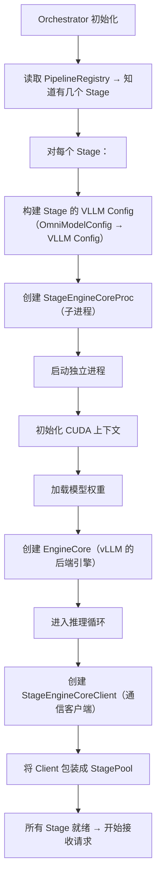
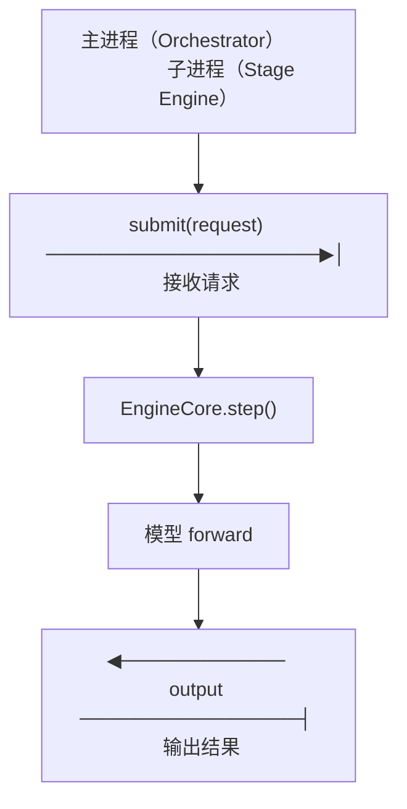

# 04 · Stage Engine 启动与通信

**源码**：
- [`code/vllm-omni/vllm_omni/engine/stage_engine_startup.py`](../../code/vllm-omni/vllm_omni/engine/stage_engine_startup.py)
- [`code/vllm-omni/vllm_omni/engine/stage_engine_core_proc.py`](../../code/vllm-omni/vllm_omni/engine/stage_engine_core_proc.py)
- [`code/vllm-omni/vllm_omni/engine/stage_engine_core_client.py`](../../code/vllm-omni/vllm_omni/engine/stage_engine_core_client.py)

## Stage 的启动流程

每个 Stage 都是一个**独立进程**，有自己的 GPU 上下文、vLLM EngineCore、模型参数。启动过程如下：



## 三个关键类

### `StageEngineCoreProc` —— Stage 进程

运行在**子进程**中，是真正的推理执行者：

```python
class StageEngineCoreProc:
    """
    子进程入口：
    1. 初始化 vLLM EngineCore
    2. 加载模型权重
    3. 进入 step() 循环
    4. 通过 IPC 与 Client 通信
    """
```

### `StageEngineCoreClient` —— Stage 客户端

运行在**主进程**中（Orchestrator 线程），是 Stage 的"遥控器"：

```python
class StageEngineCoreClient:
    """
    主进程侧：
    1. 通过 IPC 向子进程发送请求
    2. 接收子进程的输出
    3. 实现 process_engine_inputs()（Stage 间数据转换）
    """
```

### `StageEngineStartup` —— Stage 启动器

负责"创建 Proc + Client 对"，以及配置初始化：

```python
class StageEngineStartup:
    """
    为每个 Stage：
    1. 创建 OmniModelConfig
    2. 创建 StageEngineCoreProc（子进程）
    3. 创建 StageEngineCoreClient（客户端）
    4. 返回 (client, proc) 对
    """
```

## IPC（进程间通信）

主进程（Orchestrator）和子进程（Stage Engine）之间的通信方式：



具体的 IPC 实现取决于配置：
- **同机**：使用 `multiprocessing` 队列或共享内存
- **跨机**：使用 Mooncake Transfer Engine、Yuanrong 等分布式连接器

## `process_engine_inputs` —— Stage 间数据转换的关键

每个 Stage 的 Client 上有一个 `process_engine_inputs` 方法，它负责把上一 Stage 的**原始输出**转为当前 Stage 的**输入格式**：

```python
def process_engine_inputs(self, source_outputs, original_prompt, streaming_context):
    """
    source_outputs: 上一 Stage 的输出列表
    original_prompt: 用户最初输入的 prompt
    streaming_context: 流式状态

    返回：当前 Stage 的输入列表（可以是多个，如 CFG 双路径）
    """
```

这个方法的实现通常在各个模型的 `stage_input_processor` 文件中。例如：
- Qwen Omni 的 Thinker→Talker 转换：[`stage_input_processors/qwen2_5_omni.py`](../../code/vllm-omni/vllm_omni/model_executor/stage_input_processors/qwen2_5_omni.py)
- CosyVoice 的 AR→DiT 转换：[`stage_input_processors/cosyvoice3.py`](../../code/vllm-omni/vllm_omni/model_executor/stage_input_processors/cosyvoice3.py)

## 阅读时间

约 25 分钟。重点理解 Proc/Client 的配对设计（前后端分离在 Stage 级别的应用）和 `process_engine_inputs` 的作用。
