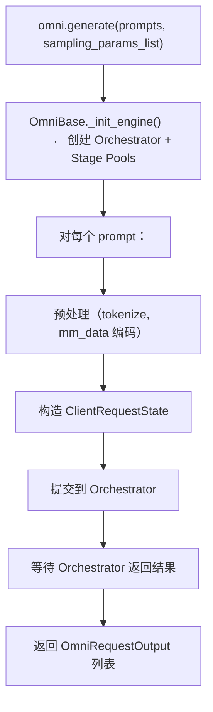

# 01 · Omni 与 AsyncOmni：两个用户入口

**源码**：
- [`code/vllm-omni/vllm_omni/entrypoints/omni.py`](../../code/vllm-omni/vllm_omni/entrypoints/omni.py)
- [`code/vllm-omni/vllm_omni/entrypoints/async_omni.py`](../../code/vllm-omni/vllm_omni/entrypoints/async_omni.py)
- [`code/vllm-omni/vllm_omni/entrypoints/omni_base.py`](../../code/vllm-omni/vllm_omni/entrypoints/omni_base.py)

## 两个入口的区别

| 特性 | `Omni` | `AsyncOmni` |
|------|--------|-------------|
| 使用场景 | 离线推理（脚本/批量处理） | 在线服务（API 服务器） |
| 调用方式 | `omni.generate(prompts, params)` | `async_omni.generate(prompts, params)` |
| 返回值 | `list[OmniRequestOutput]` 或 Generator | `list[OmniRequestOutput]` |
| 底层实现 | 同步调用 + 后台线程跑 event loop | 直接使用 asyncio |

两者都继承自 `OmniBase`，共享大部分逻辑（配置解析、采样参数处理等）。

## Omni —— 同步离线入口

```python
from vllm_omni import Omni

omni = Omni(model="Qwen/Qwen2.5-Omni-7B")

# 方式 1：一次性返回所有结果
outputs = omni.generate(
    prompts=["你好，请介绍一下自己"],
    sampling_params_list=sampling_params,
)
for output in outputs:
    print(output.text)
    print(output.audio)  # 如果模型输出了音频

# 方式 2：流式返回（生成器）
for output in omni.generate(
    prompts=["你好"],
    sampling_params_list=sampling_params,
    py_generator=True,  # 关键参数
):
    print(output.text)  # 边生成边输出
```

`Omni.generate()` 内部启动一个后台线程运行 Orchestrator 的 asyncio event loop，主线程同步等待结果。

## AsyncOmni —— 异步服务入口

```python
from vllm_omni import AsyncOmni

async_omni = AsyncOmni(model="Qwen/Qwen2.5-Omni-7B")

# 异步调用
outputs = await async_omni.generate(
    prompts=["你好"],
    sampling_params_list=sampling_params,
)
```

`AsyncOmni` 是 OpenAI 兼容 API 服务器的基础。API 服务器在[`entrypoints/openai/api_server.py`](../../code/vllm-omni/vllm_omni/entrypoints/openai/api_server.py) 中创建 `AsyncOmni` 实例，然后处理 HTTP 请求。

## OmniBase —— 共享逻辑

`OmniBase` 提供了两个子类共用的功能：

### 采样参数解析：`resolve_sampling_params_list`

```python
def resolve_sampling_params_list(self, sampling_params_list):
    # 用户可能传入的是 dict（一个 Stage 的参数），也可能只传了一个 SamplingParams
    # 这个方法将它们统一转换为 list[SamplingParams]，长度 = Stage 数量
```

### 引擎启动：`_init_engine`

```python
def _init_engine(self, ...):
    # 1. 根据模型名解析 Pipeline 配置
    # 2. 创建各个 Stage 的 EngineCore Proc
    # 3. 创建 Orchestrator
    # 4. 启动 Orchestrator 的 event loop
```

### PD 解耦支持

```python
def _maybe_expand_sampling_params(self, sampling_params_list):
    # PD 模式下用户可能只提供 N-1 组参数（因为 Prefill 和 Decode 在同一 Stage）
    # 这个方法自动补全缺失的参数
```

## 请求生命周期（从用户视角）



## ClientRequestState —— 请求在前端的表示

[`ClientRequestState`](../../code/vllm-omni/vllm_omni/entrypoints/client_request_state.py) 是请求在"前端"（Omni/AsyncOmni）中的状态表示：

- 追踪请求在哪个 Stage
- 缓存已有输出
- 管理流式输出的回调
- 记录请求的时间戳（用于计算延迟）

它与 Orchestrator 中的 `OrchestratorRequestState` 是配对关系：前者在前端，后者在后端。

## 阅读时间

约 25 分钟。`Omni` 和 `AsyncOmni` 的代码量不大，大部分逻辑在 `OmniBase` 中。
