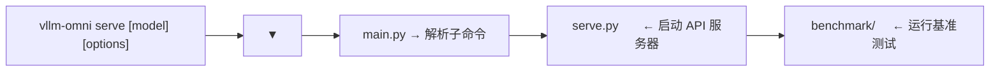

# 03 · CLI 与启动流程

**源码**：
- [`code/vllm-omni/vllm_omni/entrypoints/cli/main.py`](../../code/vllm-omni/vllm_omni/entrypoints/cli/main.py)
- [`code/vllm-omni/vllm_omni/entrypoints/cli/serve.py`](../../code/vllm-omni/vllm_omni/entrypoints/cli/serve.py)

## 命令行入口

`vllm-omni` 是一个 CLI 工具，通过 `pyproject.toml` 注册：

```toml
[project.scripts]
vllm-omni = "vllm_omni.entrypoints.cli.main:main"
```

安装后可以直接在终端使用：

```bash
# 启动 API 服务器
vllm-omni serve Qwen/Qwen2.5-Omni-7B

# 启动基准测试
vllm-omni benchmark serve --model Qwen/Qwen2.5-Omni-7B
```

## CLI 架构



## `serve` 命令 —— 启动 API 服务器

[`serve.py`](../../code/vllm-omni/vllm_omni/entrypoints/cli/serve.py) 的启动流程：

```python
# 1. 解析命令行参数
args = parse_args()

# 2. 构建引擎参数
engine_args = AsyncOmniEngineArgs(
    model=args.model,
    tensor_parallel_size=args.tensor_parallel_size,
    pipeline_parallel_size=args.pipeline_parallel_size,
    ...
)

# 3. 创建 AsyncOmni 实例
async_omni = AsyncOmni.from_engine_args(engine_args)

# 4. 启动 FastAPI + uvicorn
app = build_app(async_omni)  # api_server.py
uvicorn.run(app, host=args.host, port=args.port)
```

## 主要命令行参数

| 参数 | 含义 |
|------|------|
| `--model` / `-m` | 模型名或路径 |
| `--host` / `--port` | 服务器地址 |
| `--tensor-parallel-size` / `-tp` | 张量并行度 |
| `--pipeline-parallel-size` / `-pp` | 流水线并行度 |
| `--max-model-len` | 最大上下文长度 |
| `--gpu-memory-utilization` | GPU 显存利用率 |
| `--dtype` | 模型精度（auto/float16/bfloat16） |
| `--enforce-eager` | 禁用 CUDA Graph |
| `--quantization` / `-q` | 量化方法 |
| `--async-chunk` | 启用异步分块（流式跨 Stage） |
| `--trust-remote-code` | 信任远程代码 |
| `--enable-sleep-mode` | 允许 Stage 休眠省显存 |
| `--task-type` | TTS 任务类型（custom_voice/voice_design/base） |

## Benchmark CLI

[`benchmark/`](../../code/vllm-omni/vllm_omni/entrypoints/cli/benchmark/) 提供了性能测试命令：

```bash
# 启动基准测试服务器
vllm-omni benchmark serve --model Qwen/Qwen2.5-Omni-7B
```

这不同于 `vllm-omni serve`——benchmark serve 是以**基准测试模式**启动，会自动检查所有参与基准测试的模型的配置。

## `collect_env.py`

[`collect_env.py`](../../code/vllm-omni/collect_env.py) 是一个独立的环境信息收集脚本，和 PyTorch 的 `collect_env.py` 类似。运行时它会收集：

- 操作系统信息
- Python 版本和包列表
- CUDA/驱动版本
- PyTorch 版本
- vLLM / vLLM-Omni 版本

这在排查环境问题（尤其是 Bug Report 模板要求）时非常有用。

## 阅读时间

约 15 分钟。CLI 代码比较简单，按需了解即可。
