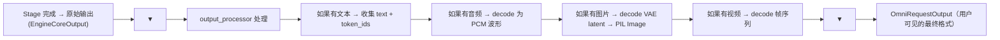

# 04 · 输入输出类型系统

**源码**：
- [`code/vllm-omni/vllm_omni/inputs/data.py`](../../code/vllm-omni/vllm_omni/inputs/data.py)
- [`code/vllm-omni/vllm_omni/outputs.py`](../../code/vllm-omni/vllm_omni/outputs.py)
- [`code/vllm-omni/vllm_omni/request.py`](../../code/vllm-omni/vllm_omni/request.py)

## 输入类型：从简单到复杂

vLLM-Omni 的输入比传统 vLLM 丰富得多，因为用户可能输入文字、图片、声音，甚至它们的组合。

### 核心 Prompt 类型

```python
# 来源: inputs/data.py

# 纯文本 Prompt（扩展 vLLM 的 TextPrompt）
class OmniTextPrompt(TextPrompt):
    prompt: str                          # 文本内容
    negative_prompt: str | None          # 负提示词（可选）
    prompt_embeds: Tensor | None         # embedding（可选）
    additional_information: dict         # 跨 Stage 附加信息

# 多模态 Prompt（文本 + 图片 + 音频）：即 vLLM 的 TextPrompt，OmniTextPrompt 继承它
class TextPrompt(TypedDict):
    prompt: str                          # 文本内容
    multi_modal_data: dict               # 图片/音频数据
    mm_processor_kwargs: dict            # 处理器参数
```

### OmniTokensPrompt —— Stage 间传递的格式

```python
class OmniTokensPrompt(TypedDict):
    prompt_token_ids: list[int]          # token ID 序列
    prompt_embeds: Tensor | None         # embedding（可选，替代 token ID）
    additional_information: dict         # 额外信息（音频控制 code 等）
    multi_modal_data: dict | None        # 多模态数据（Stage 间传递）
```

`OmniTokensPrompt` 是 Stage 间传递的主要数据格式。它既包含传统的 `prompt_token_ids`（token ID），也包含 `prompt_embeds`（连续表示），以及 `additional_information`（用于传递音频控制信号等非文本数据）。

### OmniDiffusionSamplingParams —— 扩散模型专用

```python
class OmniDiffusionSamplingParams:
    num_inference_steps: int             # 去噪步数
    guidance_scale: float                # CFG 引导强度
    width: int                           # 输出宽度
    height: int                          # 输出高度
    num_frames: int                      # 视频帧数
    seed: int                            # 随机种子
    cfg_kv_request_ids: dict[str, str] | None # CFG 双路径的请求 ID
    output_type: str                     # 输出格式（pil/numpy/pt/file）
```

## 输出类型：不只是文本

### OmniRequestOutput —— 用户最终拿到的东西

```python
class OmniRequestOutput:
    request_id: str                      # 请求 ID
    finished: bool                       # 是否完成
    stage_id: int | None                 # 产出该输出的 Stage（流水线模式）
    final_output_type: str               # 输出类型（text/image/audio/latents）
    request_output: RequestOutput | None # 底层 vLLM 输出（含 text/token_ids）
    images: list[PIL.Image]              # 扩散模型生成的图片/视频帧
    prompt: OmniPromptType | None        # 原始输入（扩散模式）
    metrics: dict[str, Any]              # 性能指标

# 文本 / 音频 / 图片 / 视频 / embedding 等模态内容由
# 底层 vLLM 的 RequestOutput（text、token_ids）与 multimodal_output 属性承载，
# vLLM-Omni 未单独定义 CompletionOutput 类。
```

注意一个请求的输出可以同时包含文本、音频、图片——这就是"全模态"输出的体现。

### 输出处理流程



### 中间输出 vs 最终输出

不是每个 Stage 的输出都会返回给用户。只有 `final_output=True` 的 Stage 的输出才会构建为 `OmniRequestOutput` 并返回用户。中间 Stage 的输出只用于 Stage 间传递。

## `additional_information` —— 跨 Stage 的"背包"

每个 Stage 可以在输出中附带 `additional_information`（一个 dict），这个信息会被序列化后传递给下一个 Stage。它就像一个"背包"，Stage 在里面放东西，下一个 Stage 拿出来用。

例如，Qwen-Omni 的 Thinker Stage 会在 `additional_information` 中放入音频控制 code，Talker Stage 拿出来作为生成声学特征的依据。

## 阅读时间

约 20 分钟。重点关注 `OmniTokensPrompt`（Stage 间传递格式）和 `OmniRequestOutput`（用户最终拿到的东西）。
