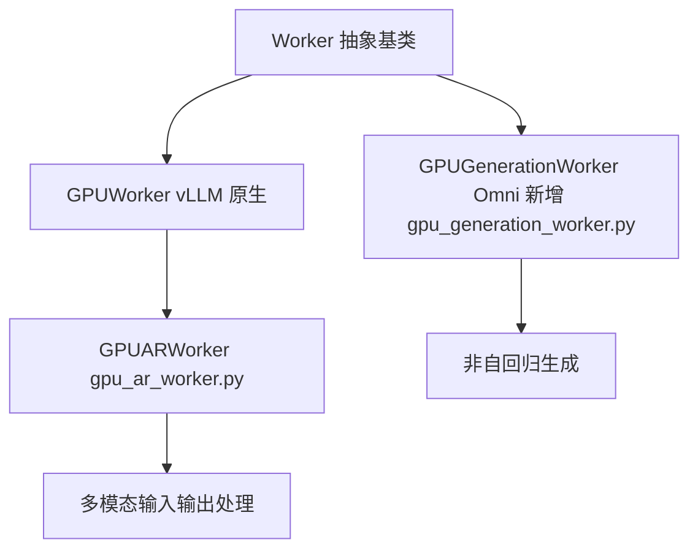
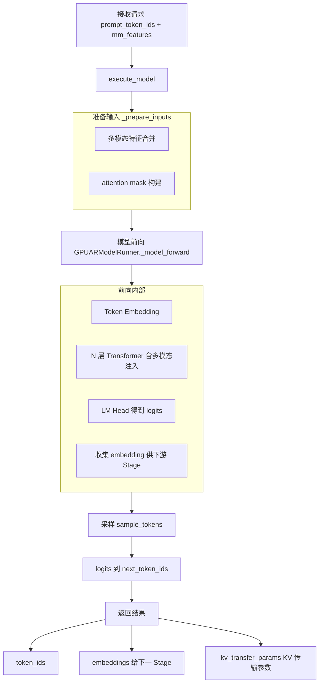

# 01 · AR Worker 与 Model Runner

**源码**：
- [`code/vllm-omni/vllm_omni/worker/gpu_ar_worker.py`](../../code/vllm-omni/vllm_omni/worker/gpu_ar_worker.py)
- [`code/vllm-omni/vllm_omni/worker/gpu_ar_model_runner.py`](../../code/vllm-omni/vllm_omni/worker/gpu_ar_model_runner.py)
- [`code/vllm-omni/vllm_omni/worker/gpu_model_runner.py`](../../code/vllm-omni/vllm_omni/worker/gpu_model_runner.py)
- [`code/vllm-omni/vllm_omni/worker/base.py`](../../code/vllm-omni/vllm_omni/worker/base.py)

## AR（Autoregressive）执行的概念

AR Worker 负责**自回归模型**的 GPU 执行。自回归的意思是"用已经生成的内容预测下一个"——和 GPT 生成文本的方式一样：一个 token 接一个 token。

vLLM-Omni 的 AR Worker 直接继承 vLLM 的 V1 Worker 架构，在此基础上增加了多模态支持。

## Worker 层次结构



## GPUARWorker —— AR 模型的工作马

```python
class GPUARWorker(GPUWorker):
    """
    在 vLLM GPUWorker 基础上：
    - 支持多模态输入（图片/音频编码后的 embedding）
    - 支持多模态输出（不只是 token，还有 embedding）
    - 支持 KV Cache 跨 Stage 传输（通过 OmniConnector）
    """
```

### 执行流程



## GPUARModelRunner —— 负责具体的模型 forward

```python
class GPUARModelRunner(GPUModelRunner):
    """
    管理模型前向计算：
    - 构造 input batch
    - 调用模型的 forward
    - 处理多模态 embedding 注入
    - 收集 hidden states（作为输出给下游 Stage）
    """
```

### 与 vLLM 原生的主要区别

1. **多模态输入融合**：在 embedding 层注入图片/音频特征
2. **额外输出收集**：除了 logits，还收集 thinker embedding（给 Talker 用）
3. **KV Cache 标记**：标记哪些 KV 需要传输给下游 Stage

## Generation Worker —— 非自回归生成

```python
class GPUGenerationWorker(GPUWorker):
    """
    用于 Talker / Code2Wav 等非自回归 Stage：
    - 不逐 token 生成，一次输出所有 token
    - 输出类型多样：声学特征、音频 code、波形
    """
```

Generation Worker 不需要 KV Cache（因为不用逐个生成），计算模式更像传统的"encoder-decoder"或"一次前向出结果"。

## GPU Model Runner 基类

[`gpu_model_runner.py`](../../code/vllm-omni/vllm_omni/worker/gpu_model_runner.py) 是 Omni 所有 Model Runner 的**共享基类**，提供了多模态相关的公共逻辑：

- 多模态数据编码
- Token embedding 和多模态 embedding 的合并
- CUDA Graph 支持

## OmniConnector Model Runner Mixin

[`omni_connector_model_runner_mixin.py`](../../code/vllm-omni/vllm_omni/worker/omni_connector_model_runner_mixin.py) 是一个 Mixin 类，为 Model Runner 添加 KV Cache 传输支持：

```python
class OmniConnectorModelRunnerMixin:
    """
    添加能力：
    - 在模型前向后，将 KV Cache 标记为"可传输"
    - 通过 OmniConnector 将 KV Cache 发送给下游 Stage
    """
```

## GPU 显存管理

[`gpu_memory_utils.py`](../../code/vllm-omni/vllm_omni/worker/gpu_memory_utils.py) 负责计算和分配每个 Stage 的 GPU 显存：

```python
# 确定每个 Stage 应该用多少 KV Cache 块
def determine_num_kv_cache_blocks(stage_config):
    # 考虑：模型权重占多少、KV Cache 需要多少、是否有其他 Stage 共享 GPU
```

## 阅读时间

约 30 分钟。先看 `gpu_ar_worker.py` 了解主流程，再看 `gpu_ar_model_runner.py` 了解模型前向细节。
