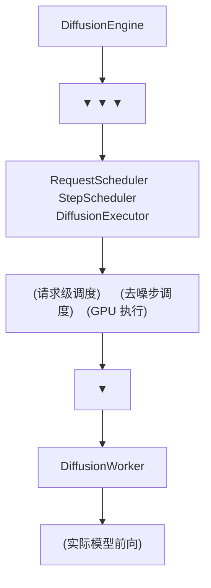

# 01 · DiffusionEngine 概览：扩散引擎的架构

**源码**：[`code/vllm-omni/vllm_omni/diffusion/diffusion_engine.py`](../../code/vllm-omni/vllm_omni/diffusion/diffusion_engine.py)

## DiffusionEngine 是什么

`DiffusionEngine` 是 vLLM-Omni 为扩散模型（DiT）专门设计的执行引擎。它不依赖 vLLM 的 V1 EngineCore，而是一个**完全独立的推理循环**。

为什么要独立？因为扩散模型的推理方式与自回归模型截然不同：

| 特性 | AR 模型 | 扩散模型 |
|------|--------|---------|
| 推理方式 | 逐 token 生成 | 多步去噪迭代 |
| 输入 | 前文 token + KV Cache | 当前噪声 + timestep + 条件 |
| 输出 | 下一个 token 的概率分布 | 预测的噪声（同维度） |
| 批处理 | Continuous Batching | 请求级批处理 |
| 显存模式 | KV Cache 动态增长 | 固定大小（噪声 + 条件） |

## DiffusionEngine 的核心组件



### 三大核心

1. **RequestScheduler**：管理多个用户的请求（哪个请求该上 GPU 了）
2. **StepScheduler**：管理一个请求的去噪步（当前该执行第几步了）
3. **DiffusionExecutor**：负责在 GPU 上跑模型 forward

## 一个扩散请求的完整生命周期

```mermaid
flowchart LR
  n0["用户提交请求（prompt + sampling_params）"]
  n1["▼"]
  n2["RequestScheduler.add_request()"]
  n3["排队等待（可能前面有其他请求）"]
  n4["▼"]
  n5["RequestScheduler 调度 → 请求进入'执行队列'"]
  n6["▼"]
  n7["StepScheduler 初始化 → 从第 0 步开始去噪"]
  n8["Step 0: 纯噪声 + 条件 → DiT forward → 预测噪声 → 更新样本"]
  n9["Step 1: 更新后样本 → DiT forward → ..."]
  n10["..."]
  n11["Step N-1: 最终去噪 → 干净样本"]
  n12["▼"]
  n13["VAE Decoder（潜空间 → 像素）"]
  n14["▼"]
  n15["后处理（可选：帧插值、超分、颜色校正）"]
  n16["▼"]
  n17["返回用户（PIL Image / numpy array / 文件路径）"]
  n0 --> n1
  n1 --> n2
  n2 --> n3
  n3 --> n4
  n4 --> n5
  n5 --> n6
  n6 --> n7
  n7 --> n8
  n8 --> n9
  n9 --> n10
  n10 --> n11
  n11 --> n12
  n12 --> n13
  n13 --> n14
  n14 --> n15
  n15 --> n16
  n16 --> n17
```



## DiffusionEngine 的核心方法

### `generate()` —— 处理一个 batch 的扩散请求

```python
def generate(self, requests: list[OmniDiffusionRequest]):
    # 1. RequestScheduler：把请求加入队列
    for req in requests:
        self.request_scheduler.add_request(req)

    # 2. 主循环：处理所有请求直到完成
    while self.request_scheduler.has_pending():
        batch = self.request_scheduler.get_batch()
        outputs = self.executor.run_batch(batch)
        self.request_scheduler.update(outputs)

    # 3. 返回结果
    return self.request_scheduler.collect_results()
```

### 请求批处理

与 AR 模型的 continuous batching 不同，扩散模型的批处理是**请求级**的：一个 batch 中的所有请求执行相同的去噪步，等这批完成后才加入新请求。

### DiffusionWorker

[`diffusion/worker/diffusion_worker.py`](../../code/vllm-omni/vllm_omni/diffusion/worker/diffusion_worker.py) 是扩散模型的 GPU Worker：

```python
class DiffusionWorker:
    def execute_model(self, batch):
        # 执行模型 forward：
        # 1. 准备 latent（噪声）输入
        # 2. 准备 timestep embedding
        # 3. 准备条件（文本 embedding）
        # 4. DiT forward → 预测噪声
        # 5. Scheduler step → 更新 latent
        return results
```

## 与 AR Engine 的交互

扩散 Stage 在 vLLM-Omni 的流水线中可以是：
- **独立 Stage**：用户直接发请求（如单独的文生图）
- **下游 Stage**：AR Stage 的输出作为扩散 Stage 的输入（如文本 embedding → 图像）

当扩散 Stage 作为下游时，`custom_process_input_func` 负责将 AR 的输出（文本 token/embedding）转为扩散模型的输入（条件）。

## 扩散引擎的数据类型

```python
# diffusion/data.py
class OmniDiffusionConfig:
    model_class_name: str             # 模型类名（如 "FluxPipeline"）
    diffusion_load_format: str        # "diffusers" 或 "gguf"
    model: str                        # 模型路径
    num_inference_steps: int          # 默认去噪步数
    vae_use_slicing: bool             # VAE 切片（省显存）
    vae_use_tiling: bool              # VAE 分块（大图用）
    parallel_config: ...              # 并行配置

class DiffusionOutput:
    images: list[PIL.Image]           # 生成的图片
    audios: list[bytes]               # 生成的音频
    videos: list[list[PIL.Image]]     # 生成的视频帧
    latents: Tensor                   # 潜空间输出（给下游用）
```

## 阅读时间

约 30 分钟。先看 `diffusion_engine.py` 的主循环，再看 `worker/diffusion_worker.py` 了解 GPU 执行细节。
