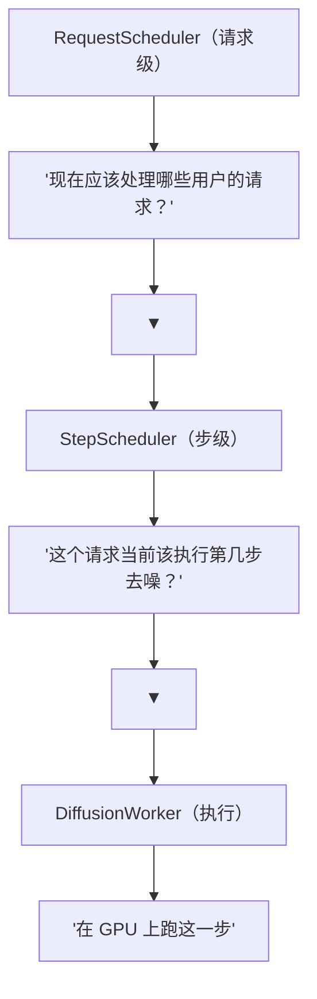

# 03 · 扩散调度器：RequestScheduler 与 StepScheduler

**源码**：
- [`code/vllm-omni/vllm_omni/diffusion/sched/interface.py`](../../code/vllm-omni/vllm_omni/diffusion/sched/interface.py)
- [`code/vllm-omni/vllm_omni/diffusion/sched/base_scheduler.py`](../../code/vllm-omni/vllm_omni/diffusion/sched/base_scheduler.py)
- [`code/vllm-omni/vllm_omni/diffusion/sched/request_scheduler.py`](../../code/vllm-omni/vllm_omni/diffusion/sched/request_scheduler.py)
- [`code/vllm-omni/vllm_omni/diffusion/sched/step_scheduler.py`](../../code/vllm-omni/vllm_omni/diffusion/sched/step_scheduler.py)

## 扩散调度器的两层结构

扩散推理需要**两层调度**：



打个比方：RequestScheduler 是餐厅的"排位系统"（决定哪桌客人先上菜），StepScheduler 是"做菜工序"（这道菜该翻面了、该加盐了）。

## RequestScheduler —— 请求级调度

[`request_scheduler.py`](../../code/vllm-omni/vllm_omni/diffusion/sched/request_scheduler.py) 管理多个用户的并发请求：

```python
class RequestScheduler:
    def add_request(self, request):
        # 新请求加入队列

    def get_batch(self):
        # 返回一批可以一起处理的请求
        # 策略：相同 resolution / num_steps 的请求可以组 batch

    def update(self, outputs):
        # 更新请求状态（完成了一步去噪）

    def has_pending(self):
        # 是否还有未完成的请求
```

### 组 Batch 策略

扩散模型对 batch 的要求比 AR 模型严格：

- 同一个 batch 中的所有请求必须有**相同的分辨率**（因为 DiT 的输入形状固定）
- 最好有**相同的步数**（否则步数少的请求完成后要等待步数多的）
- CFG 的"条件+无条件"两个路径需要同时处理

### 请求优先级

支持多种优先级策略：
- **FIFO**：先来先服务
- **Shortest Job First**：步数少/分辨率小的优先（减少平均等待时间）
- **Max Throughput**：优先组大 batch（提高 GPU 利用率）

## StepScheduler —— 去噪步调度

[`step_scheduler.py`](../../code/vllm-omni/vllm_omni/diffusion/sched/step_scheduler.py) 管理去噪过程。这不是 vLLM 的请求调度概念，而是**扩散算法**层面的调度：

```python
class StepScheduler:
    """
    管理去噪过程：
    - 初始化：t = T（最大噪声步数）
    - 每步：t → t - Δt
    - 调用算法：DDIM / Euler / Flow Match / DMD2 / ...
    - 终止：t ≈ 0
    """

    def step(self, model_output, timestep, sample):
        # 根据预测的噪声和当前 timestep，更新样本
        # 使用的算法取决于 scheduler 类型
        prev_sample = self.scheduler_algorithm.step(model_output, timestep, sample)
        return prev_sample
```

### 支持的去噪算法

vLLM-Omni 支持多种去噪调度算法（位于 [`diffusion/models/schedulers/`](../../code/vllm-omni/vllm_omni/diffusion/models/schedulers/)）：

| 算法 | 文件 | 适用模型 |
|------|------|---------|
| Flow Match Euler | `scheduling_flow_unipc_multistep.py` | Flux, Wan, LTX |
| DMD2 Euler | `scheduling_dmd2_euler.py` | 蒸馏加速模型 |
| Helios Scheduler | `models/helios/scheduling_helios.py` | Helios |
| Wan Euler | `models/wan2_2/scheduling_wan_euler.py` | Wan |
| Mammoth Scheduler | `models/mammoth_moda2/schedulers.py` | MammothModa2 |

## SchedulerInterface —— 统一接口

[`interface.py`](../../code/vllm-omni/vllm_omni/diffusion/sched/interface.py) 定义了调度器的抽象接口：

```python
class SchedulerInterface(ABC):
    @abstractmethod
    def add_request(self, request): ...

    @abstractmethod
    def get_batch(self) -> list: ...

    @abstractmethod
    def step(self, model_output, timestep, sample): ...

    @abstractmethod
    def has_pending(self) -> bool: ...
```

这样 DiffusionEngine 可以切换不同的调度策略而不需要改引擎代码。

## DiffusionRequest —— 扩散请求的数据结构

[`diffusion/request.py`](../../code/vllm-omni/vllm_omni/diffusion/request.py)：

```python
class OmniDiffusionRequest:
    request_id: str
    prompt: str                       # 文本 prompt
    negative_prompt: str | None       # 负提示词（CFG 用）
    params: OmniDiffusionSamplingParams
    latent: Tensor | None             # 当前潜变量状态
    timestep: int                     # 当前去噪步
    images: list[PIL.Image] | None    # 输入图片（图生图/编辑用）
    status: DiffusionRequestStatus    # PENDING / RUNNING / DONE / ERROR
```

## 阅读时间

约 25 分钟。重点理解两层调度（请求级 + 步级）的设计和 RequestScheduler 的组 batch 策略。
