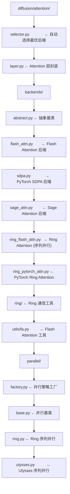
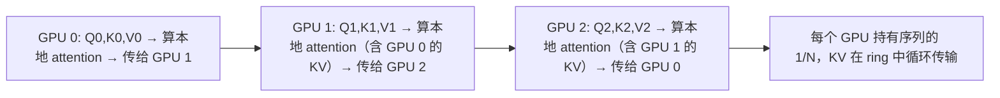

# 05 · 扩散 Attention 后端

**源码**：[`code/vllm-omni/vllm_omni/diffusion/attention/`](../../code/vllm-omni/vllm_omni/diffusion/attention/)

## 为什么扩散模型需要自己的 Attention 后端

DiT（Diffusion Transformer）使用 Attention 机制，但它的 Attention 模式和 LLM 不同：

- **序列长度**：DiT 的序列长度通常很大（如 128×128=16384 tokens），但没有 KV Cache
- **计算模式**：每次前向都是"完整的 self-attention"，没有 prefill/decode 之分
- **维度**：DiT 通常使用多模态的 attention（文本条件 + 图像 latent 的交叉注意力）

因此，vLLM 的 Attention 后端（为 AR 模型优化）不适用于 DiT。vLLM-Omni 为扩散模型单独设计了一套 Attention 后端。

## Attention 后端架构



## 各后端的区别

| 后端 | 文件 | 特点 |
|------|------|------|
| **Flash Attention** | `flash_attn.py` | 最快，需要 CUDA + flash-attn 库 |
| **PyTorch SDPA** | `sdpa.py` | PyTorch 原生，兼容性好，速度稍慢 |
| **Sage Attention** | `sage_attn.py` | 优化版，需要 sage-attn 库 |

### 后端选择逻辑

[`selector.py`](../../code/vllm-omni/vllm_omni/diffusion/attention/selector.py) 自动选择最优后端：

```python
def select_attention_backend():
    if flash_attn_available():
        return FlashAttentionBackend()
    elif sage_attn_available():
        return SageAttentionBackend()
    else:
        return PyTorchSDPABackend()
```

### Attention Backend 抽象基类

```python
class AttentionBackend(ABC):
    @abstractmethod
    def forward(self, query, key, value, attn_mask=None):
        # 执行 QKV attention
        ...
```

## 序列并行 Attention

当 DiT 的序列太长，单张 GPU 放不下时，需要序列并行。vLLM-Omni 支持两种序列并行策略：

### Ring Attention

[`parallel/ring.py`](../../code/vllm-omni/vllm_omni/diffusion/attention/parallel/ring.py)：



### Ulysses Attention

[`parallel/ulysses.py`](../../code/vllm-omni/vllm_omni/diffusion/attention/parallel/ulysses.py)：

```
所有 GPU 都有完整的 Q
KV 按 head 维度切分到不同 GPU
通过 all-to-all 通信交换 QKV
每个 GPU 算自己那部分 head 的 attention
```

Ulysses 相比 Ring 的优势是通信量更小（all-to-all vs 循环），但要求 attention head 数能被 GPU 数整除。

### 混合策略（Hybrid）

Ring + Ulysses 可以组合使用，在 head 维度和序列维度上同时做并行。

## Attention 层实现

[`layer.py`](../../code/vllm-omni/vllm_omni/diffusion/attention/layer.py) 封装了 DiT 的 Attention 层：

```python
class DiffusionAttention(nn.Module):
    """
    DiT 的 Attention 层：
    - Self-Attention（潜变量内部）
    - Cross-Attention（条件 → 潜变量）
    - 支持 AdaLN（Adaptive Layer Norm）调制
    """
```

DiT 的 Attention 与 LLM 的 Attention 最大的不同是**条件注入**——文本的 embedding 通过 cross-attention 注入到图像 latent 的处理过程中。

## 阅读时间

约 20 分钟。如果你不关心 Attention 底层实现，只需要了解有哪些后端可选即可。
