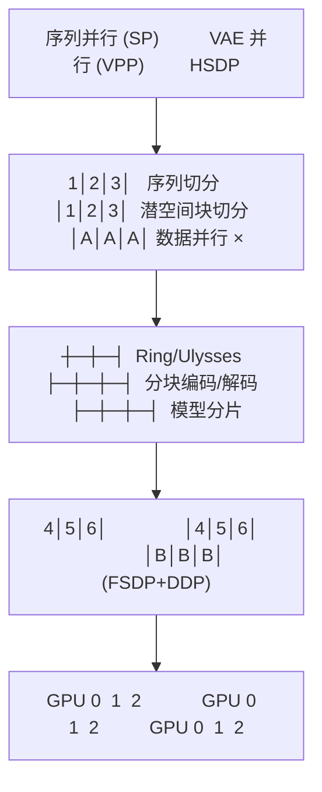
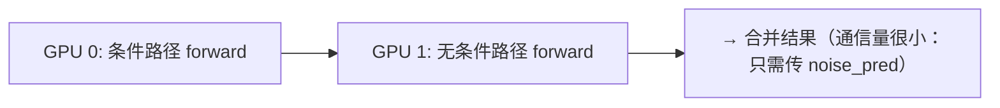

# 06 · 扩散分布式：序列并行、VAE 并行与 HSDP

**源码**：[`code/vllm-omni/vllm_omni/diffusion/distributed/`](../../code/vllm-omni/vllm_omni/diffusion/distributed/)

## 扩散模型的分布式挑战

大尺寸图像/视频生成对显存需求极高：

- 1024×1024 图像：DiT 的 latent 序列长度 = 16384（128×128）
- 1080P 视频 5 秒：序列长度可能达到数万甚至更多
- Flux.1 有 12B 参数，单张 H100（80GB）只能刚好跑推理

vLLM-Omni 提供了多种分布式策略来应对这些挑战。

## 三种并行策略



## 序列并行（Sequence Parallelism）

[`sp_plan.py`](../../code/vllm-omni/vllm_omni/diffusion/distributed/sp_plan.py) 和 [`sp_sharding.py`](../../code/vllm-omni/vllm_omni/diffusion/distributed/sp_sharding.py) 定义了序列并行的计划：

```python
class SequenceParallelConfig:
    ulysses_degree: int   # Ulysses 并行度（Q/K/V 经 all-to-all 重分布）
    ring_degree: int      # Ring 并行度（K/V 环形传输）
    # 总 SP 大小 = ulysses_degree × ring_degree
```

### `_sp_plan` —— 模型级别的并行计划

每个 DiT 模型类可以定义 `_sp_plan` 属性，声明哪些层需要序列并行：

```python
# 模型定义中（如 Wan 的 WanTransformer3DModel）
class WanTransformer3DModel:
    _sp_plan = {
        # 哪些层参与 SP：键为模块路径，值为输入/输出的切分规格
        "blocks.0": {
            "hidden_states": SequenceParallelInput(split_dim=1, expected_dims=3),
        },
    }
```

### 应用序列并行

[`hooks/sequence_parallel.py`](../../code/vllm-omni/vllm_omni/diffusion/hooks/sequence_parallel.py) 通过 PyTorch hooks 在模型前向中注入序列并行通信：

```python
def apply_sequence_parallel(model, sp_config, sp_plan):
    # 对 sp_plan 中声明的每一层，注册 pre/post forward hooks
    # pre-hook：在 attention 前做 all-to-all（Ulysses）或 ring send/recv
    # post-hook：在 attention 后做反向通信，恢复完整序列
```

## VAE Patch 并行（VPP）

[`vae_patch_parallel.py`](../../code/vllm-omni/vllm_omni/diffusion/distributed/vae_patch_parallel.py) 实现了 VAE 的并行编码/解码：

```mermaid
flowchart LR
  n0["无并行："]
  n1["大图 → VAE Encoder（单 GPU）→ latent"]
  n2["VAE Patch 并行（VPP=4）："]
  n3["大图 → 切成 4 块"]
  n4["Block 0 → GPU 0 VAE Encode → latent[0]"]
  n5["Block 1 → GPU 1 VAE Encode → latent[1]"]
  n6["Block 2 → GPU 2 VAE Encode → latent[2]"]
  n7["Block 3 → GPU 3 VAE Encode → latent[3]"]
  n8["→ 拼接为完整 latent"]
  n0 --> n1
  n1 --> n2
  n2 --> n3
  n3 --> n4
  n4 --> n5
  n5 --> n6
  n6 --> n7
  n7 --> n8
```



VPP 对于高分辨率图像/视频特别重要：VAE 不是 Transformer，不能简单地做张量并行，但像素可以在空间上分块处理。

### DistributedVaeMixin

[`autoencoders/distributed_vae_executor.py`](../../code/vllm-omni/vllm_omni/diffusion/distributed/autoencoders/distributed_vae_executor.py)：

```python
class DistributedVaeMixin:
    """
    为 VAE 添加分布式能力：
    - set_parallel_size(vpp_size)
    - 自动将输入分块分发到各 GPU
    - 在编码/解码后收集结果
    """
```

各模型的 VAE 实现（`autoencoder_kl.py`, `autoencoder_kl_qwenimage.py`, `autoencoder_kl_wan.py`）继承这个 Mixin 来获得分布式能力。

## HSDP（Hybrid Sharding Data Parallel）

[`hsdp.py`](../../code/vllm-omni/vllm_omni/diffusion/distributed/hsdp.py) 和 [`hsdp_utils.py`](../../code/vllm-omni/vllm_omni/diffusion/distributed/hsdp_utils.py) 实现了混合分片数据并行：

```python
# HSDP 结合了 FSDP（在节点内）和 DDP（跨节点）
# 节点内：模型分片存储（FSDP），节省显存
# 跨节点：复制模型副本（DDP），减少通信
```

## CFG 并行

[`cfg_parallel.py`](../../code/vllm-omni/vllm_omni/diffusion/distributed/cfg_parallel.py) 将 CFG 的条件路径和无条件路径分配到不同的 GPU：



## 并行状态管理

[`parallel_state.py`](../../code/vllm-omni/vllm_omni/diffusion/distributed/parallel_state.py) 管理分布式环境：

```python
# 初始化分布式环境与并行组
init_distributed_environment()          # torch.distributed 环境
initialize_model_parallel(              # SP / CFG / DP / TP / PP 并行组
    sequence_parallel_size=sp_size,
    cfg_parallel_size=cfg_size,
)
```

## 通信工具

[`comm.py`](../../code/vllm-omni/vllm_omni/diffusion/distributed/comm.py) 封装了底层的通信操作（all-reduce, all-gather, send/recv 等）。

## 阅读时间

约 30 分钟。如果你不关心分布式细节，了解三种并行策略（SP/VPP/HSDP）的概念即可。
