# 01 · 模型注册与加载：OmniModelRegistry

**源码**：
- [`code/vllm-omni/vllm_omni/model_executor/models/registry.py`](../../code/vllm-omni/vllm_omni/model_executor/models/registry.py)
- [`code/vllm-omni/vllm_omni/model_executor/model_loader/`](../../code/vllm-omni/vllm_omni/model_executor/model_loader/)

## 模型注册系统的作用

vLLM-Omni 需要支持 20+ 种不同的模型架构（且持续增长）。当用户指定 `--model Qwen/Qwen2.5-Omni-7B` 时，系统需要：

1. 读取模型目录下的 `config.json`
2. 识别 `"architectures": ["Qwen2_5OmniForConditionalGeneration"]`
3. 映射到对应的 Python 实现类
4. 加载权重
5. 创建模型实例

`OmniModelRegistry` 就是做第 3 步的——它是一个"模型架构名 → Python 类"的字典。

## OmniModelRegistry

```python
OmniModelRegistry = _ModelRegistry({
    "Qwen2_5OmniForConditionalGeneration": _LazyRegisteredModel(
        module_name="vllm_omni.model_executor.models.qwen2_5_omni.qwen2_5_omni",
        class_name="Qwen2_5OmniForConditionalGeneration",
    ),
    "Qwen3OmniMoeForConditionalGeneration": _LazyRegisteredModel(
        module_name="vllm_omni.model_executor.models.qwen3_omni.qwen3_omni",
        class_name="Qwen3OmniMoeForConditionalGeneration",
    ),
    # ... 20+ 个模型
})
```

注意 `OmniModelRegistry` 包含了 vLLM 原生的 `_VLLM_MODELS`（所有 LLM 模型）加上 Omni 的 `_OMNI_MODELS`。这样 vLLM-Omni 同时支持纯文本 LLM 和全模态模型。

## 注册模型的三元组

```python
"Qwen2_5OmniForConditionalGeneration": (
    "qwen2_5_omni",                           # mod_folder：在 models/ 下的目录
    "qwen2_5_omni",                           # mod_relname：Python 文件名
    "Qwen2_5OmniForConditionalGeneration",    # cls_name：类名
)
```

实际模块路径：`vllm_omni.model_executor.models.qwen2_5_omni.qwen2_5_omni`

## 延迟加载（Lazy Loading）

`_LazyRegisteredModel` 不会在 import 时立即加载模型类，而是在**第一次需要时**才加载：

```python
class _LazyRegisteredModel:
    def load_model_cls(self):
        module = importlib.import_module(self.module_name)
        return getattr(module, self.class_name)
```

这样可以避免在 import vllm_omni 时加载所有模型的代码（很多模型有重依赖）。

## 模型加载器

[`model_loader/`](../../code/vllm-omni/vllm_omni/model_executor/model_loader/) 负责实际的权重加载：

### `weight_utils.py` —— 权重加载工具

```python
def download_weights_from_hf_specific(model_name_or_path, cache_dir, allow_patterns, ...):
    # 从 HuggingFace Hub 下载权重（safetensors / pytorch .bin）
    # 支持按 allow_patterns 只下载必要的权重文件
```

### 加载流程

```python
# 1. 从注册表获取类
model_cls = OmniModelRegistry._try_load_model_cls(arch)

# 2. 实例化（不加载权重）
model = model_cls(config)

# 3. 加载权重
load_weights(model, model_path)

# 4. 移动到 GPU
model = model.cuda()
```

## 模型实现目录结构

```mermaid
flowchart TD
  n0["model_executor/models/"]
  n1["qwen2_5_omni/          ← Qwen2.5-Omni"]
  n2["qwen2_5_omni.py    ← 主模型类"]
  n3["qwen2_5_omni_thinker.py"]
  n4["qwen2_5_omni_talker.py"]
  n5["qwen2_5_omni_token2wav.py"]
  n6["pipeline.py        ← Stage 流水线定义"]
  n7["qwen3_omni/            ← Qwen3-Omni (MoE)"]
  n8["qwen3_tts/             ← Qwen3-TTS"]
  n9["cosyvoice3/            ← CosyVoice 3"]
  n10["fish_speech/           ← Fish Speech S2 Pro"]
  n11["mimo_audio/            ← MiMo Audio"]
  n12["ming_flash_omni/       ← Ming Flash Omni 2.0"]
  n13["glm_image/             ← GLM Image"]
  n14["bagel/                 ← OmniBagel"]
  n15["hunyuan_image3/        ← Hunyuan Image 3"]
  n16["dynin_omni/            ← Dynin Omni"]
  n17["mammoth_moda2/         ← MammothModa2"]
  n18["voxcpm/ / voxcpm2/     ← VoxCPM"]
  n19["voxtral_tts/           ← Voxtral TTS"]
  n20["omnivoice/             ← OmniVoice"]
  n21["moss_tts_nano/         ← MOSS TTS Nano"]
  n22["common/                ← 共享组件"]
  n23["snake_activation.py"]
  n24["qwen3_code_predictor.py"]
  n0 --> n1
  n1 --> n2
  n2 --> n3
  n3 --> n4
  n4 --> n5
  n5 --> n6
  n6 --> n7
  n7 --> n8
  n8 --> n9
  n9 --> n10
  n10 --> n11
  n11 --> n12
  n12 --> n13
  n13 --> n14
  n14 --> n15
  n15 --> n16
  n16 --> n17
  n17 --> n18
  n18 --> n19
  n19 --> n20
  n20 --> n21
  n21 --> n22
  n22 --> n23
  n23 --> n24
```



## 阅读时间

约 15 分钟。了解注册表的结构即可，后续用到哪个模型再看具体实现。
