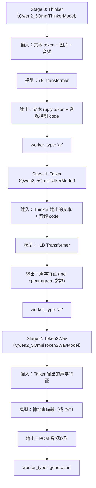

# 02 · 全模态模型：Qwen2.5-Omni 与 Qwen3-Omni

**源码**：
- [`code/vllm-omni/vllm_omni/model_executor/models/qwen2_5_omni/`](../../code/vllm-omni/vllm_omni/model_executor/models/qwen2_5_omni/)
- [`code/vllm-omni/vllm_omni/model_executor/models/qwen3_omni/`](../../code/vllm-omni/vllm_omni/model_executor/models/qwen3_omni/)

## Qwen2.5-Omni：三 Stage 全模态模型

Qwen2.5-Omni 是 vLLM-Omni 的"旗舰模型"，最能体现多 Stage 流水线设计。它支持文本、图像、音频的任意输入输出组合。

### Stage 拆分



### `qwen2_5_omni/` —— 模型类

```python
class Qwen2_5OmniForConditionalGeneration(nn.Module):
    """
    主模型类（通常在 Stage 0 使用）：
    - 包含多模态编码器（视觉 + 音频）
    - Thinker Transformer
    - 输出文本 token + 音频控制 code
    """

class Qwen2_5OmniThinkerForConditionalGeneration(nn.Module):
    """Thinker 阶段单独使用时的模型类（注册名 Qwen2_5OmniThinkerModel）"""

class Qwen2_5OmniTalkerForConditionalGeneration(nn.Module):
    """Talker 阶段单独使用时的模型类（注册名 Qwen2_5OmniTalkerModel）"""
```

### `pipeline.py` —— Stage 流水线定义

```python
# qwen2_5_omni/pipeline.py
QWEN2_5_OMNI_PIPELINE = PipelineConfig(
    model_type="qwen2_5_omni",
    model_arch="Qwen2_5OmniForConditionalGeneration",
    stages=(
        StagePipelineConfig(stage_id=0, model_stage="thinker", execution_type=StageExecutionType.LLM_AR),
        StagePipelineConfig(stage_id=1, model_stage="talker", execution_type=StageExecutionType.LLM_AR),
        StagePipelineConfig(stage_id=2, model_stage="code2wav", execution_type=StageExecutionType.LLM_GENERATION),
    ),
)
```

### `stage_input_processors/qwen2_5_omni.py`

定义了 Thinker → Talker → Token2Wav 的数据转换逻辑：

```python
def thinker2talker(source_outputs, prompt):
    # 从 Thinker 输出中提取：
    # - 文本 reply token（用于 Talker 知道说什么）
    # - 音频控制 code（用于 Talker 知道怎么说）
    # 返回 OmniTokensPrompt
```

## Qwen3-Omni：MoE 升级版

Qwen3-Omni 是 Qwen2.5-Omni 的升级版，核心变化是使用了 MoE（Mixture of Experts）架构：

```python
# qwen3_omni/qwen3_moe.py
class Qwen3MoeModel(nn.Module):
    """
    MoE Transformer：
    - FFN 层被替换为 MoE 层
    - 每个 token 只激活部分 expert（如 8/64）
    - 参数总量增大但计算量可控
    """
```

### 主要文件

| 文件 | 功能 |
|------|------|
| `qwen3_omni.py` | 主模型类 |
| `qwen3_moe.py` | MoE 层实现 |
| `qwen3_omni_moe_thinker.py` | MoE Thinker |
| `qwen3_omni_moe_talker.py` | MoE Talker |
| `qwen3_omni_code2wav.py` | Code2Wav |
| `qwen3_omni_moe_code_predictor_mtp.py` | 多 token 预测（MTP） |
| `pipeline.py` | Stage 流水线定义 |

### MTP（Multi-Token Prediction）

Qwen3-Omni 支持一次预测多个 token（MTP），这能显著加速推理。相关实现在 `qwen3_omni_moe_code_predictor_mtp.py` 中。

## 阅读时间

约 30 分钟。Qwen2.5-Omni 是多 Stage 架构的最佳范例，懂了它就懂了整个 vLLM-Omni 的设计。
