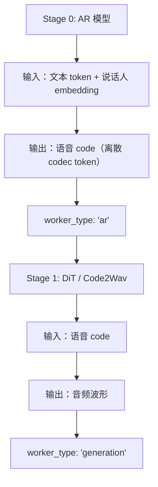
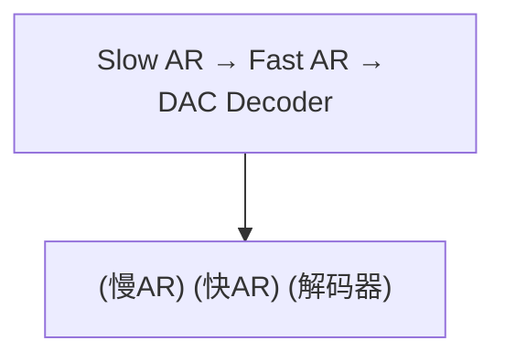

# 03 · 语音模型：CosyVoice / MiMo / FishSpeech 等

**源码**：
- [`code/vllm-omni/vllm_omni/model_executor/models/cosyvoice3/`](../../code/vllm-omni/vllm_omni/model_executor/models/cosyvoice3/)
- [`code/vllm-omni/vllm_omni/model_executor/models/mimo_audio/`](../../code/vllm-omni/vllm_omni/model_executor/models/mimo_audio/)
- [`code/vllm-omni/vllm_omni/model_executor/models/fish_speech/`](../../code/vllm-omni/vllm_omni/model_executor/models/fish_speech/)
- [`code/vllm-omni/vllm_omni/model_executor/models/ming_flash_omni/`](../../code/vllm-omni/vllm_omni/model_executor/models/ming_flash_omni/)

## 语音模型的分类

vLLM-Omni 支持的语音模型大致可以分三类：

| 类型 | 模型 | 工作方式 |
|------|------|---------|
| **全模态（含语音）** | Qwen-Omni, Ming-Flash-Omni | Thinker 理解语音 → Talker 生成语音 |
| **纯 TTS** | CosyVoice3, Qwen3-TTS, Voxtral TTS, MOSS-TTS, Fish Speech | 文字 → 语音 |
| **语音对话** | MiMo Audio | 语音 → 语音（end-to-end） |

## CosyVoice3 —— 阿里开源的 TTS 模型

CosyVoice3 将"文本→语音"分成两个 Stage：



### 关键文件

| 文件 | 功能 |
|------|------|
| `cosyvoice3.py` | 主模型类 |
| `cosyvoice3_talker.py` | AR Talker（文本→语音 code） |
| `cosyvoice3_code2wav.py` | Code2Wav（语音 code→波形） |
| `code2wav_core/hifigan.py` | HiFi-GAN 声码器 |
| `code2wav_core/cfm.py` | Conditional Flow Matching（替代扩散） |
| `tokenizer.py` | 语音 tokenizer |
| `config.py` | CosyVoice3 专属配置 |

### CFM（Conditional Flow Matching）

CosyVoice3 的 Code2Wav 阶段可以使用 CFM 而不是传统的扩散模型。CFM 是一种更高效的生成方法——它学习概率流而不是去噪过程，通常只需 10 步就能生成高质量音频。

## MiMo Audio —— 语音到语音

MiMo Audio 是端到端的语音对话模型：

```python
class MiMoAudioForConditionalGeneration:
    """
    输入：音频波形
    输出：音频波形
    中间：通过 LLM 理解和生成回复
    """
```

它的 Stage 拆分：
- `MiMoAudioLLMModel`：理解输入语音并生成回复的语音 code
- `MiMoAudioToken2WavModel`：将 code 解码为波形

## Fish Speech —— 开源 TTS

Fish Speech 使用三 Stage 架构：



- **Slow AR**：高质量地生成语音特征
- **Fast AR**：快速生成（知识蒸馏自 Slow AR）
- **DAC Decoder**：将特征解码为波形

关键文件：
- `fish_speech_slow_ar.py`：慢 AR 模型
- `fish_speech_fast_ar.py`：快 AR 模型
- `fish_speech_dac_decoder.py`：DAC 解码器
- `dac_encoder.py`：DAC 编码器（训练用）

## Ming-Flash-Omni —— 端到端语音对话

Ming-Flash-Omni 支持完整的语音对话：

```python
class MingFlashOmniForConditionalGeneration:
    """
    - audio_encoder：语音编码器（Whisper 风格）
    - vision_encoder：视觉编码器
    - thinker：基于 Bailing MoE v2 的 Thinker
    - talker：语音生成 Talker
    - spk_embedding：说话人音色嵌入
    """
```

关键文件：
- `ming_flash_omni.py`：主模型
- `ming_flash_omni_thinker.py`：Thinker（理解+生成回复）
- `ming_flash_omni_talker.py`：Talker（生成语音）
- `modeling_bailing_moe_v2.py`：Bailing MoE v2 架构
- `audio_encoder.py`：音频编码器
- `vision_encoder.py`：视觉编码器
- `spk_embedding.py`：说话人嵌入
- `voice_presets.py`：预设音色

## 其他 TTS 模型

| 模型 | 特点 |
|------|------|
| **Qwen3-TTS** | Qwen 的 TTS 模型，支持 12Hz/25Hz tokenizer |
| **Voxtral TTS** | 基于声学 Transformer + 音频生成器 |
| **VoxCPM / VoxCPM2** | MiniCPM 系列的全模态模型 |
| **MOSS-TTS-Nano** | 小型的 TTS 模型 |
| **OmniVoice** | 全模态语音模型，支持 Diffusion 管线 |

## 阅读时间

约 35 分钟。建议按感兴趣的模型按需阅读，不需要全部看完。
