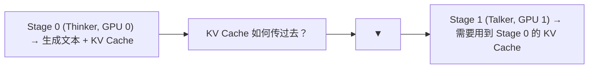
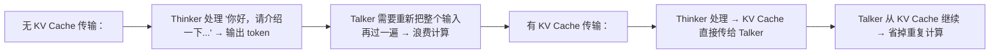
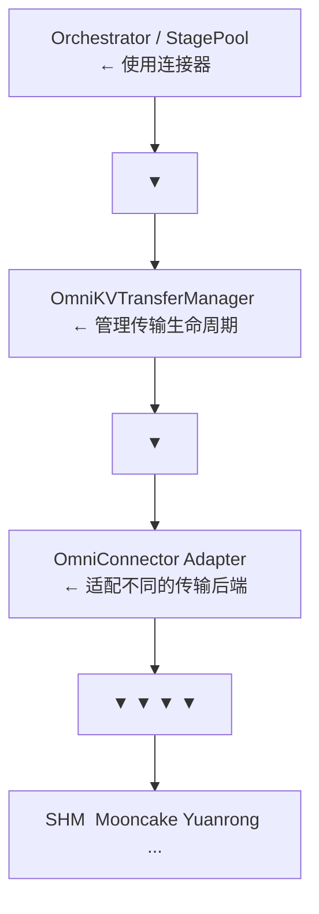

# 01 · OmniConnector 架构：跨 Stage KV Cache 传输

**源码**：[`code/vllm-omni/vllm_omni/distributed/omni_connectors/`](../../code/vllm-omni/vllm_omni/distributed/omni_connectors/)

## OmniConnector 解决什么问题

在多 Stage 流水线中，Stage 之间需要传递数据。最常见的场景是：



OmniConnector 就是解决 **"KV Cache 如何跨 Stage（跨进程、跨 GPU、甚至跨机器）传输"** 的组件。

## 为什么 KV Cache 需要传输

Talker/Decoder Stage 在生成时需要"看到"Thinker 已经处理过的输入。如果没有 KV Cache 传输，Talker 就需要**重新计算** Thinker 做过的所有计算，浪费大量算力。



## OmniConnector 的抽象层次



## OmniKVTransferManager —— 传输管理器

[`kv_transfer_manager.py`](../../code/vllm-omni/vllm_omni/distributed/omni_connectors/kv_transfer_manager.py) 负责 KV Cache 传输的全生命周期：

```python
class OmniKVTransferManager:
    def handle_finished_requests_kv_transfer(self, finished_reqs, kv_caches, ...):
        # 从 GPU blocks 提取 KV Cache 并传输给下游 Stage

    def receive_kv_cache(self, req, target_device=None):
        # 接收 KV Cache 并填充请求对象（旧接口）

    def receive_multi_kv_cache(self, req, ...):
        # 接收主 KV Cache 与可选的 CFG 伴随 KV Cache
```

## 连接器工厂

[`factory.py`](../../code/vllm-omni/vllm_omni/distributed/omni_connectors/factory.py) 根据配置创建连接器实例：

```python
def create_connector(config: dict):
    name = config["name"]
    if name == "SharedMemoryConnector":
        return SharedMemoryConnector(config)
    elif name == "MooncakeTransferEngineConnector":
        return MooncakeTransferEngineConnector(config)
    elif name == "YuanrongConnector":
        return YuanrongConnector(config)
    ...
```

## 传输适配器

[`transfer_adapter/`](../../code/vllm-omni/vllm_omni/distributed/omni_connectors/transfer_adapter/) 提供了传输方式的抽象：

- `base.py`：传输适配器基类
- `chunk_transfer_adapter.py`：分块传输（大 KV Cache 分块传，避免 OOM）

## KV 传输工具

[`utils/`](../../code/vllm-omni/vllm_omni/distributed/omni_connectors/utils/) 提供了传输相关的工具：

- `kv_utils.py`：KV Cache 的序列化和反序列化
- `serialization.py`：tensor 序列化
- `config.py`：连接器配置解析
- `initialization.py`：连接器初始化
- `logging.py`：传输日志

## Monkey Patch

[`kv_transfer/monkey_patch.py`](../../code/vllm-omni/vllm_omni/distributed/kv_transfer/monkey_patch.py) 通过"猴子补丁"修补 vLLM 原生 MooncakeConnector 的请求 ID 不匹配问题（PD 解耦下 Prefill 与 Decode 引擎会为同一请求生成不同的 ID 后缀）：

```python
# 把 remote_request_id 通过 kv_transfer_params 传递
# 使 Decode 侧引用 Prefill 引擎中正确的 KV Cache 条目
```

## 阅读时间

约 20 分钟。理解 OmniConnector 要解决的问题和抽象层次即可，具体连接器实现按需阅读。
