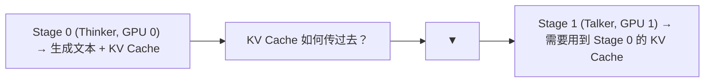
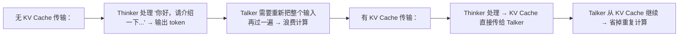
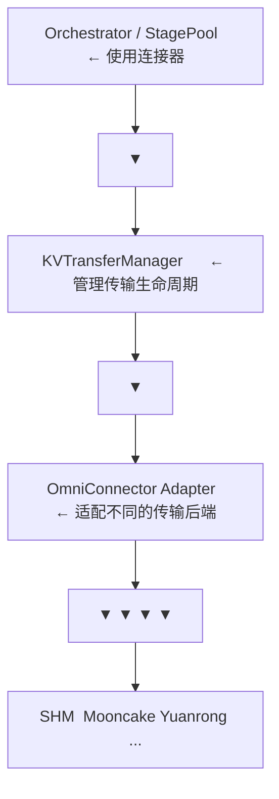

# 01 · OmniConnector 架构：跨 Stage KV Cache 传输

**源码**：[`code/vllm-omni/vllm_omni/distributed/omni_connectors/`](../../code/vllm-omni/vllm_omni/distributed/omni_connectors/)

## OmniConnector 解决什么问题

在多 Stage 流水线中，Stage 之间需要传递数据。最常见的场景是：



OmniConnector 就是解决 **"KV Cache 如何跨 Stage（跨进程、跨 GPU、甚至跨机器）传输"** 的组件。

## 为什么 KV Cache 需要传输

Talker/Decoder Stage 在生成时需要"看到"Thinker 已经处理过的输入。如果没有 KV Cache 传输，Talker 就需要**重新计算** Thinker 做过的所有计算，浪费大量算力。



## OmniConnector 的抽象层次



## KVTransferManager —— 传输管理器

[`kv_transfer_manager.py`](../../code/vllm-omni/vllm_omni/distributed/omni_connectors/kv_transfer_manager.py) 负责 KV Cache 传输的全生命周期：

```python
class KVTransferManager:
    def start_transfer(self, kv_blocks, target_stage):
        # 发起 KV Cache 传输

    def wait_for_completion(self, transfer_id):
        # 等待传输完成

    def get_transfer_status(self, transfer_id):
        # 查询传输状态
```

## 连接器工厂

[`factory.py`](../../code/vllm-omni/vllm_omni/distributed/omni_connectors/factory.py) 根据配置创建连接器实例：

```python
def create_connector(config: dict):
    name = config["name"]
    if name == "SharedMemoryConnector":
        return SharedMemoryConnector(config)
    elif name == "MooncakeTransferEngineConnector":
        return MooncakeTransferEngineConnector(config)
    elif name == "YuanrongConnector":
        return YuanrongConnector(config)
    ...
```

## 传输适配器

[`transfer_adapter/`](../../code/vllm-omni/vllm_omni/distributed/omni_connectors/transfer_adapter/) 提供了传输方式的抽象：

- `base.py`：传输适配器基类
- `chunk_transfer_adapter.py`：分块传输（大 KV Cache 分块传，避免 OOM）

## KV 传输工具

[`utils/`](../../code/vllm-omni/vllm_omni/distributed/omni_connectors/utils/) 提供了传输相关的工具：

- `kv_utils.py`：KV Cache 的序列化和反序列化
- `serialization.py`：tensor 序列化
- `config.py`：连接器配置解析
- `initialization.py`：连接器初始化
- `logging.py`：传输日志

## Monkey Patch

[`kv_transfer/monkey_patch.py`](../../code/vllm-omni/vllm_omni/distributed/kv_transfer/monkey_patch.py) 通过"猴子补丁"修改 vLLM 原生的 KV Cache 行为，使其支持跨 Stage 传输：

```python
# 在 vLLM EngineCore 的 step() 之后拦截 KV Cache
# 将其序列化并通过 OmniConnector 发送给下游 Stage
```

## 阅读时间

约 20 分钟。理解 OmniConnector 要解决的问题和抽象层次即可，具体连接器实现按需阅读。
