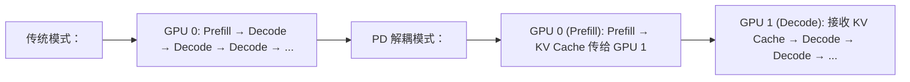
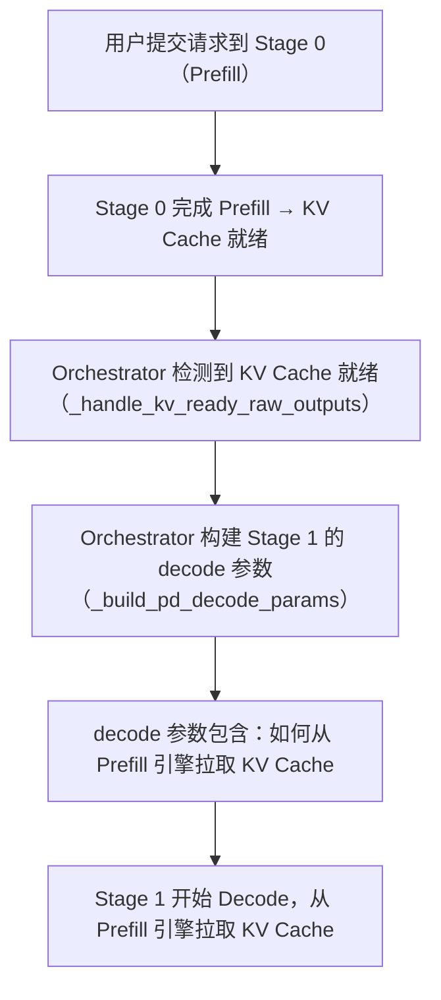
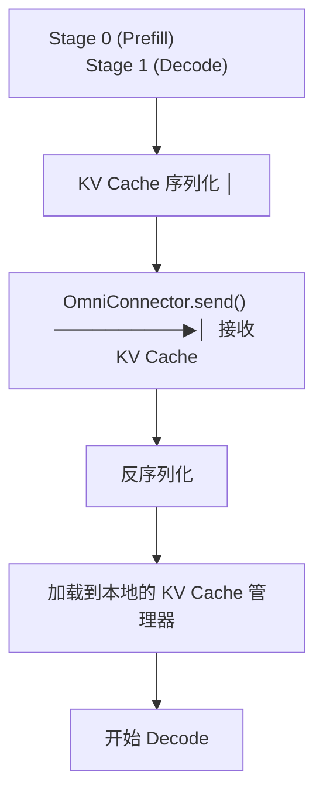

# 03 · PD 解耦：Prefill-Decode 分离

**源码**：
- [`code/vllm-omni/vllm_omni/entrypoints/pd_utils.py`](../../code/vllm-omni/vllm_omni/entrypoints/pd_utils.py)
- [`code/vllm-omni/vllm_omni/engine/orchestrator.py`](../../code/vllm-omni/vllm_omni/engine/orchestrator.py) 中的 `_build_pd_decode_params` 方法

## PD 解耦是什么

在 vLLM 中，模型推理分两个阶段：

1. **Prefill**（预填充）：一次处理整个输入 prompt，建立 KV Cache
2. **Decode**（解码）：逐 token 生成输出，更新 KV Cache

传统的做法是 Prefill 和 Decode 在同一个 GPU（同一个 EngineCore）上进行。PD 解耦则是**把 Prefill 和 Decode 分到不同的 GPU/Stage** 上：



### 为什么需要 PD 解耦

- **Prefill 是计算密集型**（大量 token 一次处理），需要高算力
- **Decode 是显存密集型**（KV Cache 很大），需要大显存
- 两种不同的工作负载放在一起会导致资源利用不均衡

## vLLM-Omni 中的 PD 解耦

在 vLLM-Omni 的多 Stage 架构中，PD 解耦体现为 Stage 的分离：

```python
# Orchestrator 中的 PD 配置
self._pd_pair = (0, 1)          # Stage 0 做 Prefill，Stage 1 做 Decode
self._pd_bootstrap_addr = "..." # Prefill 引擎的地址
self._pd_prefill_engine_id = "..." # Prefill 引擎 ID
```

### PD 请求的生命周期



### `_build_pd_decode_params` —— 构建 Decode 参数

```python
def _build_pd_decode_params(self, req_id, sp):
    # 克隆采样参数
    sp = sp.clone()

    # 注入 KV 传输参数
    sp.extra_args["kv_transfer_params"] = {
        "do_remote_prefill": True,
        "do_remote_decode": False,
        "remote_bootstrap_addr": self._pd_bootstrap_addr,
        "remote_engine_id": self._pd_prefill_engine_id,
        "remote_request_id": ...,  # Prefill 侧的请求 ID
    }
    return sp
```

### `pd_utils.py` —— PD 工具函数

```python
# 支持 PD 模式的 prompt 扩展
# PD 模式下用户可能只提供 N-1 组采样参数
# （因为 Prefill+Decode 逻辑上是一个 Stage 的两个物理部分）
```

## PD 与 OmniConnector 的关系

PD 解耦**依赖** OmniConnector 来传输 KV Cache：



## 阅读时间

约 20 分钟。PD 解耦是一个高级优化特性，理解了概念就行，实现细节在 Orchestrator 的 `_forward_to_next_stage` 和 OmniConnector 中。
