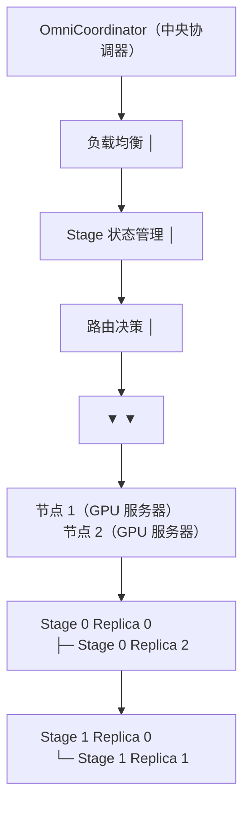
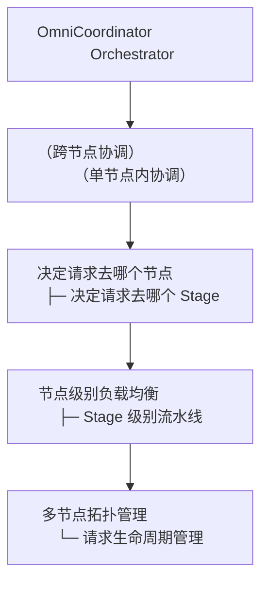

# 04 · OmniCoordinator：多节点部署协调

**源码**：[`code/vllm-omni/vllm_omni/distributed/omni_coordinator/`](../../code/vllm-omni/vllm_omni/distributed/omni_coordinator/)

## OmniCoordinator 是什么

当 vLLM-Omni 部署在**多台机器**上时，需要一个"中央调度中心"来协调各个 Stage 的实例。OmniCoordinator 就是做这件事的。



## 核心组件

### `omni_coordinator.py` —— 主协调器

```python
class OmniCoordinator:
    """
    负责：
    - 维护所有节点的注册信息
    - 接收客户端的注册/心跳
    - 分配请求到具体的 Stage 实例
    - 监控实例健康状态
    """
```

### `load_balancer.py` —— 负载均衡器

```python
class LoadBalancer:
    """
    决定请求应该路由到哪个节点/实例：
    - 轮询（Round Robin）
    - 最少队列长度（Least Queue Length）
    - 随机（Random）
    - 其他策略可实现为 LoadBalancer 的子类
    """
```

### `messages.py` —— 通信消息

定义了协调器和客户端之间的消息格式：

```python
# 实例注册/更新消息（Stage → Coordinator）
{"event_type": "update", "input_addr": "tcp://...", "output_addr": "tcp://...", "stage_id": 0, "status": "up", "queue_length": 0}

# 心跳消息（Stage → Coordinator）
{"event_type": "heartbeat", "input_addr": "tcp://...", "output_addr": "tcp://...", "stage_id": 0, "status": "up", "queue_length": 7}

# 实例列表发布（Coordinator → Hub）
{"instances": [{"stage_id": 0, "status": "up", "queue_length": 0, ...}]}
```

### `omni_coord_client_for_hub.py` —— 对外入口的客户端

API 服务器（Hub）使用这个客户端连接到 OmniCoordinator，获取路由信息。

### `omni_coord_client_for_stage.py` —— Stage 的客户端

每个 Stage 实例使用这个客户端向 OmniCoordinator 注册自己并上报状态。

## 工作流程


## Ray Utils

[`ray_utils/`](../../code/vllm-omni/vllm_omni/distributed/ray_utils/) 包含使用 Ray 进行分布式部署的工具：

```python
# ray_utils/utils.py
# 使用 Ray 的 placement group 来管理 GPU 资源分配
# 方便在 Ray 集群上部署 vLLM-Omni
```

## 与 Orchestrator 的关系



OmniCoordinator 是 Orchestrator 的"上一级"：先决定请求去哪个节点，然后由该节点的 Orchestrator 负责请求在该节点内部的 Stage 间流转。

## 阅读时间

约 20 分钟。如果你只在单机部署，可以跳过这一节。多节点部署时再回头看即可。
