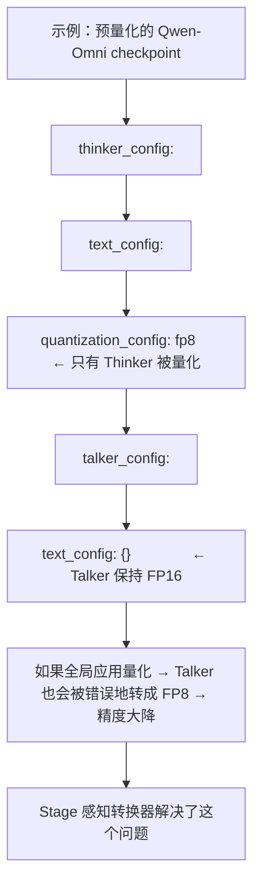

# 01 · 量化支持：INT8 / INC / GGUF / Component

**源码**：[`code/vllm-omni/vllm_omni/quantization/`](../../code/vllm-omni/vllm_omni/quantization/)

## 量化是什么

量化（Quantization）是用低精度（如 8-bit、4-bit）存储和计算模型参数的技术。好处是显存减半、速度提升，代价是精度可能略微下降。

vLLM-Omni 在 vLLM 原生量化方案的基础上，增加了对扩散模型和特殊量化格式的支持。

## int8_config.py —— INT8 量化

```python
class DiffusionInt8Config:
    """
    INT8 权重量化：
    - 将 FP16 权重压缩到 INT8
    - 推理时动态反量化（weight-only）或使用 INT8 矩阵乘法
    - 显存减半，精度损失小
    """
```

INT8 是 vLLM-Omni 最常用的量化方案，对 AR 模型（Thinker）和扩散模型（DiT）都适用。

## inc_config.py —— INC 量化

INC（Intel Neural Compressor）是 Intel 的量化工具链：

```python
class OmniINCConfig:
    """
    Intel Neural Compressor 量化：
    - 支持 INT8/INT4
    - 适用于 CPU 和 Intel GPU（XPU）
    - 需要预先用 INC 工具量化模型并保存 checkpoint
    """
```

## gguf_config.py —— GGUF 量化

GGUF（GPT-Generated Unified Format）是 llama.cpp 生态的模型格式，vLLM-Omni 扩展了对扩散模型 GGUF 的支持：

```python
class DiffusionGGUFConfig:
    """
    GGUF 格式支持：
    - 适用于 Flux2 Klein、Z-Image、Qwen-Image 等
    - 通常在 4-bit 或 8-bit 精度
    - 模型发布时已经是 GGUF 格式
    """
```

GGUF 量化对扩散模型特别有用——DiT 模型动辄 10B+ 参数，FP16 需要 20GB 显存，INT4 只需要 5GB。

### GGUF 适配器

[`diffusion/model_loader/gguf_adapters/`](../../code/vllm-omni/vllm_omni/diffusion/model_loader/gguf_adapters/) 包含了各扩散模型的 GGUF 适配器：

- `flux2_klein.py`：Flux2 Klein 的 GGUF 适配
- `qwen_image.py`：Qwen-Image 的 GGUF 适配
- `z_image.py`：Z-Image 的 GGUF 适配
- `base.py`：GGUF 适配器基类

## component_config.py —— 组件级量化

```python
class ComponentQuantizationConfig:
    """
    组件级量化：
    - 不是整个模型统一量化
    - 对不同子模块使用不同的量化策略
    - 例如：Attention 用 FP8，FFN 用 INT4
    """
```

这对于多 Stage 模型特别重要——不同 Stage 对精度的敏感度不同：
- Thinker 的 Attention 层对精度敏感 → 用 FP8
- Thinker 的 FFN 层不太敏感 → 用 INT4
- Talker 可以整体用 INT8
- Code2Wav 通常不量化（波形质量敏感）

## quantization/factory.py —— 量化方案工厂

[`factory.py`](../../code/vllm-omni/vllm_omni/quantization/factory.py) 统一创建量化配置：

```python
def build_quant_config(spec):
    if spec == "fp8":
        return Fp8Config()
    elif spec == "int8":
        return DiffusionInt8Config()
    elif spec == "gguf":
        return DiffusionGGUFConfig()
    elif spec == "inc":
        return OmniINCConfig()
    ...
```

## 量化与 Stage 感知

在"配置系统"一节中提到过，`OmniModelArchConfigConvertor` 确保每个 Stage 只应用**属于自己的量化配置**。这是因为多 Stage 模型中可能只有部分 Stage 被量化：



## 扩散模型的量化

扩散模型的量化在 `diffusion/registry.py` 中处理：

```python
def _prepare_diffusion_quant_config(od_config, model_class):
    quant_config = od_config.quantization_config
    if quant_config is not None:
        # 更新量化配置中的模型特定信息
        quant_config.maybe_update_config(od_config.model)
        # 配置 packed modules mapping
        configure_quant_config(quant_config, model_class)
```

## 阅读时间

约 20 分钟。了解有哪几种量化方案即可，按需深入研究。
