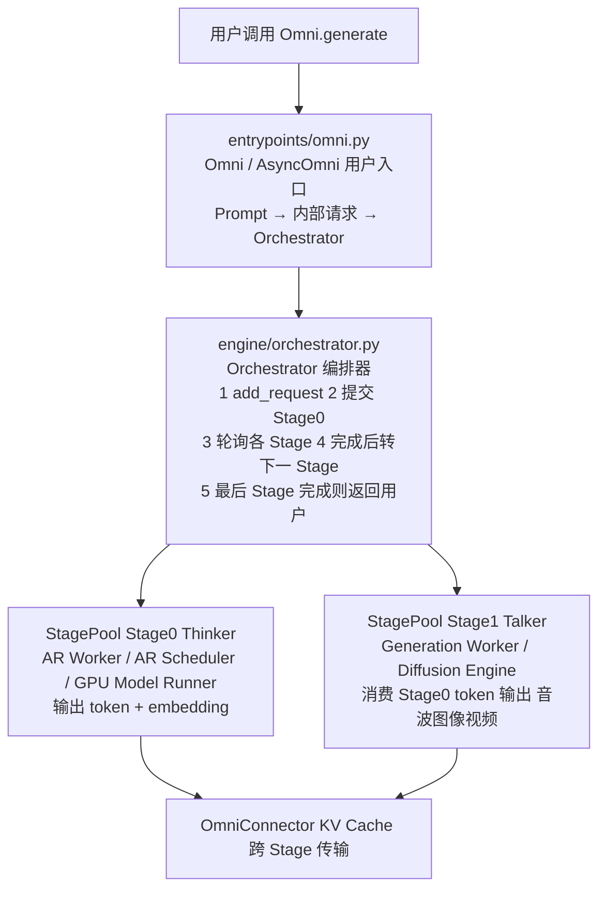
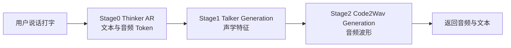
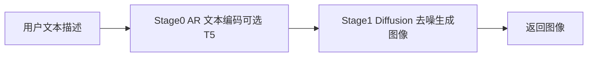

# vLLM-Omni 源码学习路径

> 基于对 `code/vllm-omni/vllm_omni/` 目录的通读生成，按学习阶段分目录组织。
> 源码位置：`code/vllm-omni/`（与本学习路径同级）

## 这是什么项目

vLLM-Omni 是 vLLM 的扩展框架，专门做一件事：**让各种模态的模型都能在 vLLM 上高效推理**。传统的 vLLM 只管文本生成（LLM），而 vLLM-Omni 把它扩展到了图像、视频、音频的生成和理解。

打个比方：vLLM 是一个只能处理文字的"翻译官"，vLLM-Omni 则是一个"全栈多媒体处理中心"——文字、图片、声音、视频都能处理，而且各种格式还能互相转换。

## 整体架构（读代码前先看这张图）

**核心设计理念**：

1. **多阶段流水线（Multi-Stage Pipeline）**：复杂模型拆成多个"阶段"，每个阶段是一个独立的推理进程。比如 Qwen-Omni 拆成 Thinker（想）→ Talker（说）→ Code2Wav（合成声音）三个 Stage。
2. **编排器（Orchestrator）**：流水线的"调度员"，负责请求在 Stage 之间的流转。
3. **双引擎**：同时支持 AR 引擎（处理自回归文本生成）和 Diffusion 引擎（处理扩散模型的图像/视频/音频生成）。
4. **OmniConnector**：Stage 间的数据传输通道，支持共享内存、Mooncake、Yuanrong 等方式。

## 学习阶段

| 阶段 | 目录 | 内容 | 学时 |
|------|------|------|------|
| 0 | [00-前置知识](00-前置知识/) | vLLM基础、全模态模型概念、扩散模型 | 1~2 小时 |
| 1 | [01-项目总览与入口](01-项目总览与入口/) | 符号地图、项目结构、配置系统 | 1~2 小时 |
| 2 | [02-多阶段流水线核心](02-多阶段流水线核心/) | 流水线架构、Orchestrator、StagePool | 3~5 小时 |
| 3 | [03-入口与API层](03-入口与API层/) | Omni/AsyncOmni、OpenAI API、CLI | 2~3 小时 |
| 4 | [04-自回归执行(AR Worker)](04-自回归执行(AR%20Worker)/) | AR Worker、调度器、采样与输出 | 3~4 小时 |
| 5 | [05-扩散模型执行(Diffusion Engine)](05-扩散模型执行(Diffusion%20Engine)/) | 扩散引擎、注册表、调度器、分布式 | 4~6 小时 |
| 6 | [06-模型实现](06-模型实现/) | 模型注册、各模态模型、Pipeline模式 | 3~5 小时 |
| 7 | [07-分布式与OmniConnector](07-分布式与OmniConnector/) | KV传输、PD解耦、多节点协调 | 2~4 小时 |
| 8 | [08-高级特性](08-高级特性/) | 量化、缓存加速、LoRA、多平台 | 2~3 小时 |

## 两条主线：Omni 模型 vs 扩散模型

vLLM-Omni 处理两类主要的模型场景，代码路径不同：

### 主线 A：全模态对话模型（如 Qwen-Omni）

### 主线 B：扩散生成模型（如 Flux 文生图）

## 阅读建议

1. **先读 00-前置知识**，了解 vLLM 基础、全模态模型和扩散模型的基本概念，不然后面会看不懂
2. **再看 README 架构图**，建立全局认知
3. **阶段 1~3 可以并行阅读**：如果你对用户 API 更感兴趣先看阶段 3，对架构设计感兴趣先看阶段 2
4. **阶段 4 和 5 代表了两种不同的执行引擎**，可以先读你感兴趣的那个
5. **阶段 6 按需阅读**：用到哪个模型就看哪个
6. **阶段 7 和 8 是进阶内容**，了解核心流程后再深入

每个文件末尾都标注了**源码路径**和**建议阅读时间**，可以参考着源码一起读。
